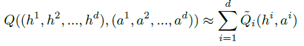

# 0. Abstract

이 논문은 single joint reward signal를 사용하는 Cooperative multi-agent reinforcement learning(MARL) 문제에 대해 연구한다. 이 문제는 일반적으로 action, observation space가 크고 복잡해 어려움이 있다.

중앙집중형(Centralized) 방식과 분산형(Decentralized) 방식 모두에서 partial observability 때문에 발생하는 <u>spurious rewards 문제와 lazy agent 문제</u>를 발견했다. 이러한 문제를 해결하기 위해, 새로운 아키텍처는 에이전트 각각을 학습하는 방식을 제안한다. <u>이 새로운 아키텍처는 team value function을 agent-wise value function으로 분해하여 학습하는 value decomposition network 아키텍처이다.</u>

다양한 partial observable multi-agent 환경에서 실험을 수행했고 이러한 분해 방식이 특히 weight sharing, role information, information channels과 결합될 때 더 우수한 성능을 보인다.

---

# 1. Introduction

MARL 문제는 최근 자율 주행 차량이나 교통 신호를 조정하는 교통 시스템, 또는 여러 상호작용으로 이루어진 공장의 생산성 최적화 같은 곳에서 사용된다. 그렇기 때문에 공동 목표를 달성하기 위해 협력하는 것을 학습해야 한다.

cooperative MARL은 여러 학습 에이전트들이 하나의 보상 신호 즉, 팀 보상을 최대화하게 최적화해야 한다.이러한 협력적인 MARL 문제를 이론적으로는 중앙집중형(Centralized)방식으로 처리할 수 있다. 모든 관측을 연결하고 모든 action space를 조합해 single-agent RL 문제로 바꿀 수 있다.

## 1.1 Centralized

하지만 중앙집중형 방식은 단순한 문제에서도 실패하는 문제가 있다. 한 에이전트만 활동하고 다른 에이전트는 활동하지 않는 <u>Lazy Agent 문제</u>가 발생한다.

이런 현상은 한 에이전트가 유용한 정책을 학습한 상황에서, 다른 에이전트의 exploration이 첫 번째 에이전트의 성능을 떨어뜨려 팀 보상을 감소시킬 위험이 있기 때문에 학습 자체를 회피하게 되는 경우에 발생한다.

## 1.2 Independent Learners

또 다른 방식으로는 Independent Learners들을 훈련시켜 팀 보상을 최적화하는 것이다. 일반적으로 이 방식은 각각의 에이전트가 학습을 하면서 행동을 바꾸기 때문에 환경이 변해 에이전트가 non-staionary한 환경에서 학습하게 된다.

또한 단일 에이전트 관점에서 환경은 parially observed하기 때문에 다른 에이전트의 행동을 확인하지 못해 <u>spurious reward</u>를 받을 수 있다는 문제가 있다.

## 1.3 Value-decomposition

위의 두 방식 모두 에이전트 수가 많아질수록 문제가 더 심해진다. 대부분의 보상을 각 에이전트가 확인하지 못하고, 중앙집중형의 경우 action space가 지수적으로 증가하기 때문이다.

Independent Learners 방식의 성능을 개선하기 위해선 개별 에이전트의 관측에 더 직접적으로 관련된 보상 함수를 설계하는 것이지만 그것은 단일 에이전트에서도 어려운 문제이다.

이러한 문제를 해결하기 위해 이 논문은 개별 에이전트에 대해 새로운 Value-decomposition 방식을 제안한다. Value-decomposition network는 team reward signal로 부터 최적의 선형 Value-decomposition을 하기 위해 학습한다. 각 요소의 value function을 나타내는 deep NN에서 전체 Q-gradient를 backpropagating하는 방식으로 동작한다.

이 value-additive한 decomposition은 Independent Learners에서 나타나는 spurious reward 문제를 해결하기 위해 제안됐다. 

이 논문의 주요 비교 대상은 세 가지 아키텍처이다.

1. Value-decomposition
2. Independent learners
3. Centralized approaches

세 가지를 비교한 결과 Value-Decomposition이 더 뛰어난 성능을 보인다. 또한 여기에 추가 기법들을 결합하면 지속적으로 가장 우수한 성능을 내는 에이전트를 만들 수 있음을 확인했다.

추가 기법은 샘플 효율성과 메모리 요구사항을 개선하는 데 유용한 weight sharing, role information, information channels이다.

---

# 2. A Deep-RL Architecture for Coop-MARL

DQN-style 에이전트에다가 MARL 문제에서 나타나는 문제점을 극복하기 위한 다양한 기법을 추가해 Value-decomposition라는 아키텍처를 구현한다. <u>이 방식의 핵심 가정은 joint action-value function을 각 에이전트의 value-function으로 분해가 가능하다는 것</u>이다.

$\tilde{Q}_i$는 각 에이전트의 local observations만을 기반으로 한다.
joint reward으로부터 Q-Learning 방식을 통해 구한 gradients를 backpropagation해 $\tilde{Q}_i$를 학습한다.

즉, $\tilde{Q}_i$는 에이전트 i만을 위한 보상 없이도 암묵적으로 학습되고 $\tilde{Q}_i$를 특정 보상에 대응하는 action value라는 제약을 부과하지 않는다.

이 방식의 장점은 학습 시에는 일부 중앙화가 필요하지만 학습된 에이전트는 독립적으로 deploy 할 수 있다는 점이다. 즉, 각 에이전트가 local value $\tilde{Q}_i$에 대해 탐욕적 행동을 취하더라도 중앙 제어자가 $\tilde{Q}_i$의 합을 최대화하도록 행동을 선택하도록 한다. 그렇기 때문에 독립적으로 deploy가 가능하다.

에이전트 2개를 고려할 때 보상이 다음과 같이 분해가 가능하다고 가정한다.

이 구조는 에이전트가 자신의 goal만 관측하고 다른 에이전트의 goal은 모를 때 발생할 수 있다. 이때 Q값을 다음과 같이 분해할 수 있다.

이 아키텍처는 이러한 간단한 형태로의 분해가 자연스럽게 발생한다.

이러한 아키텍처는 가능하면 간단한 함수로 분해하는 것을 원한다. 학습할 파라미터 수를 줄이기 위한 한 가지 방법은 에이전트들 간에 일부 network weights를 공유하는 것이다. 이는 또한 Agent Invariance 개념으로 이어지며, 이는 lazy agent 문제를 완화하는 데 도움이 된다.

가 성립하면, 정책 $$\pi$$가 Agent Invariance하다고 한다. Agent Invariance는 에이전트가 바뀌어도 전체 정책이 달라지지 않는 성질이다. 하지만 일부 상황에서는 에이전트에게 특화된 role이 필요하기 때문에, 항상 agent invariance를 원하는 것은 아니다.

이런 경우, 각 에이전트에게 1-hot 벡터로 된 역할 정보(또는 ID)를 관측과 함께 제공한다. 이렇게 하면 network weights를 공유하더라도, 같은 역할을 가진 에이전트에 대해서만 동일한 정책을 가지게 되어 conditional agent invariance을 만족하게 된다.

또한, 에이전트 네트워크 간에 information channel 을 연결할 수도 있는데, 이는 미분 가능한 연결 구조로 되어 있어 학습이 가능하다. 이러한 아키텍처들은 가중치 공유와 결합될 경우, Agent Invariance를 만족할 수 있다.

# 3. Results

위의 방식들을 활용해 여러 task에 대해 비교 실험을 진행했다.

V : Value-decomposition

S : Shared weights and invariant network

Id : role info provided

L : Lower-level communication

H : Higher-level communication

C : Centralization

IL : Individual Learners

실험 결과 Value-Decomposition 기반의 아키텍처들은, 다른 기법이 포함되든 아니든 상관없이 Centralization방식이나 individual learners보다 훨씬 뛰어난 성능을 보이는 것을 확인할 수 있다.

---

# 4. Conclusions

single joint reward만 주어지는 Cooperative-MARL 문제에 대해 연구했다.

실험 결과, 두 가지 naive한 접근 방식인 individual agent와 fully centralized agent 두 방식 모두 만족스럽지 못한 결과를 냈다.

반면 이 논문이 제안하는 방식인 Value-Decomposition Networks는 같은 문제가 없었고 더 복잡하고 다양한 작업들에서 우수한 성능을 보였다. 또한, 이 방식은 weight sharing 및 information channels와도 잘 결합될 수 있어,  문제를 최적으로 해결하는 에이전트를 만들 수 있었다.

[맨 위로 이동하기](#){: .btn .btn--primary }{: .align-right}
