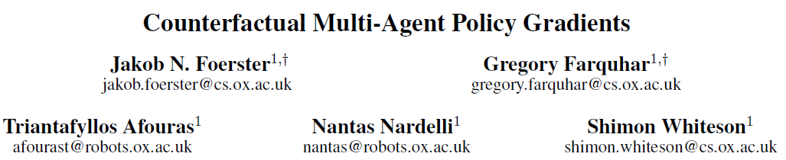

COMA는 credit assignment 문제 즉, 어떤 agent가 얼마나 기여를 했는지를 파악이 어렵다는 문제를 Counterfactual baseline이라는 개념을 도입해 파악한다.

Counterfactual baseline은 Advantage를 하나의 Centralised critic을 통해 agent가 선택한 action이 default action에 비해서 얼마나 좋은지 계산한다.

또한 Counterfactual baseline 만으로는 효율적인 연산이 불가했는데 Critic representation를 바꿔서 순방향만으로도 연산이 가능하게 해 활용이 가능하게 했다.

# 0. Abstract

이 논문은 Counterfactual Multi-Agent(COMA) Policy Gradients라는 새로운 Multi-agent Actor-Critic 방식을 제안한다.

COMA는 Q-function을 추정하기 위해 중앙집중형(centralised) Critic을 사용하고, Agent들의 정책을 최적화하기 위해 탈중앙형(decentralised) Actor를 사용한다.

또한 Multi-agent credit assignment 문제를 해결하기 위해, 한 agent의 action만 주변 상황에서 marginalise하고 나머지 agent들의 action은 고정하는 counterfactual baseline을 사용한다. counterfactual baseline은 단일 순방향 연산만으로 효율적인 계산이 가능하다.

COMA를 StarCraft unit micromanagement testbed에서 부분 관측성이 큰 탈중앙형 변형으로 평가한 결과 다른 Multi-agent Actor-Critic 방식보다 성능이 좋았고 전체 상태에 접근할 수 있는 centralised 컨트롤러와 경쟁할만한 성능을 보였다.

# 1. Introduction

자율 주행, 네트워크 패킷 전달, 물류 분배와 같은 문제를 cooperative한 Multi-agent 시스템으로 모델링이 가능하다. 하지만 <u>agent 수가 늘어날 수록 joint action space가 지수적으로 증가</u>하기 때문에 단일 agent를 위한 강화학습 방법은 이러한 Task에 적합하지 않다. 

이러한 복잡성을 해결하기 위해 각 agent가 local action-observation history에만 기반해 독립적으로 action을 선택하는 탈중앙형 정책이 필요하다. 또한 부분 관측성과 통신의 제약 때문에 탈중앙형 정책을 필요로 한다.

또 다른 문제는 <u>Multi-agent credit assignment</u>이다. cooperative한 환경에서는 joint actions이 하나의 보상을 만들기 때문에 agent 각각의 팀의 성공에 기여한 정도를 파악하기 힘들다. 이를 위해선 개별 보상 함수를 설계해야하지만 이것도 일반적으로 불가능하다.

이러한 문제들을 해결하기 위해서 이 논문은 Counterfactual Multi-Agent (COMA) Policy Gradients라는  Actor-Critic 방식에 기반으로 하는 새로운 Multi-agent 강화학습 방법을 제안한다.

COMA는 세 가지 핵심 아이디어를 사용한다.

1. Centralised critic
2. Counterfactual baseline
3. Critic representation

COMA를 StarCraft unit micromanagement testbed에서 평가했다. 이 환경은 높은 stochasticity, 큰 state-action space, 그리고 지연된 보상이 특징으로 도전적인 강화학습 벤치마크로 주목받았다.

기존 연구들은 전체 state에 접근 가능한 중앙집중형 제어 정책과 강력한 매크로 action을 사용했지만, COMA는 더욱 어려운 탈중앙형 시나리오를 만들기 위해, 각 agent의 시야를 제한하고 매크로 action을 제거한 버전으로 평가을 진행했다.

그 결과 COMA는 기존 Multi-agent Actor-Critic 방식과 COMA ablated 버전들과 비교해 높은 성능을 보였다. 또한 COMA의 최상위 agent는 전체 상태에 접근할 수 있는 중앙집중형 컨트롤러와 경쟁할만한 성능을 보였다.

---

# 4. Methods

## 4.1 Independent Actor-Critic (IAC)

여러 agent에게 Policy gradient를 적용하는 가장 간단한 방법은 각 agent가 자신의 action-observation history를 바탕으로 자신의 Actor와 Critic을 갖고 독립적으로 학습하는 것이다. 이것을 Independent Actor-Critic (IAC)라고 한다.

IAC의 구현에서 학습 속도를 높이기 위해 모든 agent가 하나의 Actor와 Critic을 공유해 파라미터 공유를 적용한다. 각 agent는 서로 다른 관측 값과 고유 ID를 입력받기 때문에, 서로 다른 action을 할 수 있으며 각자의 hidden state를 발전시킬 수 있다.

하지만 IAC에서의 학습은 여전히 독립적이고, 에이전트의 Critic은 전체가 아닌 Local value function을 추정한다. 구현이 간단하지만 학습 중 정보를 공유하지 않기 때문에 agent 간의 coordinated strategies학습 혹은 credit assignment 문제 해결이 어렵다.

---

## 4.2 Counterfactual Multi-Agent Policy Gradients(COMA)

IAC의 문제는 파라미터 공유만으로는 학습이 중앙집중형이라는 점을 충분히 활용하지 못하기 때문에 발생한다. 이러한 한계를 극복하기 위해 COMA Policy gradient를 제안한다. COMA는 세 가지 핵심 아이디어를 기반으로 한다:

1. Centralised Critic
2. Counterfactual Baseline
3. Critic Representation

### 4.2.1 Centralised Critic

IAC에서는 각 agent의 정책 $$\pi(u^a \mid \tau^a)$$과 Critic $$Q(\tau^a, u^a)$$ 또는 $$V(\tau^a)$$가 자신의 action-observation history $$\tau^a$$ 에만 의존한다. 하지만 실행 시에는 Actor만 필요하고 학습은 중앙집중형으로 이루어지므로, 학습 중에는 global state s에 조건을 거는 Centralised Critic을 사용할 수 있다.

가장 naive한 방식은 TD 오차를 사용해 각 Actor의 gradient를 계산하는 것이다.

그러나 이 방식은 credit assignment 문제를 해결하지 못한다. TD error는 global 보상만을 고려하기 때문에, 각 agent가 얻는 gradient는 해당 agent의 기여도를 직접적으로 반영하지 않는다. 특히 agent 수가 많거나 다른 agent가 탐색 중일 경우 gradient의 노이즈가 커진다.

### 4.2.2 Counterfactual Baseline

위의 문제를 해결하기 위해 COMA는 Counterfactual Baseline를 사용한다. 이것은 difference rewards에 기반한 개념이다. agent a에 대한 보상 $$D^a$$은 다음과 같다.

즉, agent a의 action이 default action($$c^a$$)보다 더 나은 결과를 낳았다면, $$D^a$$는 양수가 되어 해당 action이 global reward에 기여한 것을 알 수 있다.

하지만 difference rewards는 보통 시뮬레이터를 통해 Counterfactual 시나리오를 직접 평가해야 하므로, 계산 비용이 크다. 이를 <u>function approximation로 대체하려 했지만 여전히 default action을 정하는 것에 있어서 어려움이 있다.</u>

### 4.2.3 Centralised Critic

COMA의 가장 중요한 핵심은 중앙집중형 Critic을 사용해 difference rewards를 근사해 앞서 언급한 문제들을 피할 수 있다는 것이다.

COMA는 Q-value를 추정하는 중앙집중형 Critic인 joint action u, central state s, joint action observation history $$\tau$$를 갖는 $$Q(s,\tau,u)$$를 학습한다. 이를 통해 각 에이전트는 아래 식으로 advantage function을 계산할 수 있다.

Advantage function은 centralized critic을 사용해 추가 시뮬레이션 계산없이 agent의 experience에서 직접 학습된 action만 변하는 조건부 conterfactual에 대해 추론하는 각 agent에 대해 별도의 baseline을 계산한다.

### 4.2.4 Critic Representation

만약 critic이 Deep NN라면 계산 Cost가 비쌀 수 있다. critic의 출력 노드가 joint action space의 크기인 $$U^n$$과 같아질 수 있어 비효율적으로 된다. 이를 해결하기 위해 COMA는 효율적인 critic representation을 사용한다.

다른 agent들의 actions인 $$u_t^{-a}$$를 네트워크의 입력으로 하고 각 agent의 action의 Q값을 출력으로 한다. 이렇게 되면 counterfactual advantage는 순방향으로 효율적으로 actor, critic을 계산할 수 있다.

출력의 개수는 $$U^n$$이 아닌 $$U$$로 줄어든다. 

### 4.2.5 Lemma 1

Lemma 1은 COMA가 correct policy value(perfect critic)가 주어졌을 때 local optimal policy로 수렴함을 이론적으로 보장한다.

---

# 5.Experimental Setup

## 5.1 Ablations

COMA의 세 가지 핵심 요소를 검증하기 위해 ablation 실험을 수행한다. 모든 방법에서 Actor는 동일한 구조와 학습 방식을 사용하며, Critic은 TD(λ)로 학습된다.

1. 중앙집중형 Critic의 중요성
    
    IAC의 두가지 변형과 비교를 하는데 두 경우 모두 agent 간 파라미터 공유를 유지하고, egocentric observations과 agent ID를 입력에 포함시켜 각기 다른 action이 가능하도록 한다.
    
    - IAC-Q: Actor와 동일한 분산 입력을 사용하고, 각 action마다 Q값을 출력
    - IAC-V: 동일한 입력을 받아 하나의 state-value (V)를 출력
2. V 대신에 Q를 학습하는 것의 중요성
    - central-V: 중앙 상태를 입력으로 사용하지만, Q 대신 V(s)를 학습함.
    - policy gradient 업데이트에는 TD error를 통해 Advantage를 추정.
3. counterfactual baseline의 유용성
    - central-QV: Q와 V를 동시에 학습하고 Advantage을 Q − V로 추정.

---

## 6. Results

네 가지의 스타크래프트 시나리오에서의 평균 승률을 에피소드 수에 따라 표시한 것이다. COMA가 다른 방법들에 비해서 좋은 성능을 내는 것을 확인할 수 있다.

---

## 7. Conclusions & Future Work

이 논문은 COMA policy gradients라는 방법을 제안한다. COMA는 중앙집중형 Critic을 사용해 탈중앙형 정책을 위한 counterfactual advantage를 추정하는 방법이다.

<u>OMA는 credit assignment 문제를 해결하기 위해</u> 다른 agent들의 action은 고정하고 하나의 agent의 action만 marginalise하는 counterfactual baseline를 사용해 multi-agent credit assignment 문제를 해결한다. 즉 <u>모든 정보를 볼 수 있는 중앙집중형 critic을 도입해서 각 agent의 policy로 인한 Advantage를 계산한다.</u>

실험 결과 COMA는 다른 Multi-agent Actor-Critic 방식보다 성능이 좋았고 학습 속도가 빨랐다. 또한 중앙집중형 컨트롤러와 경쟁할만한 성능을 보였다.

향후 연구는 더 많은 agent가 포함된 시나리오로 COMA를 확장하거나 샘플 효율성이 높은 방식을 개발하는 것을 목표로한다.

[맨 위로 이동하기](#){: .btn .btn--primary }{: .align-right}
