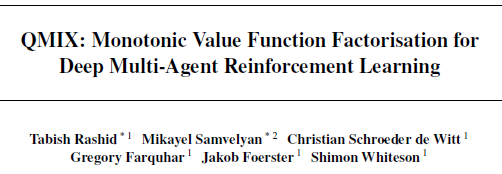

QMIX의 등장까지 흐름을 한번 잡아보면

현실 세계에서는 agent들이 decentralised하게 행동해야 한다. (한 agent는 다른 agent들의 상태를 직접 알 수 없다.)

근데 decentralised하게 학습을 하려니 학습 도중 다른 agent들도 policy가 변해서 환경이 non-stationary해지고,
joint action을 고려해야 하니까 joint action space가 지수적으로 커지는 문제가 발생한다.

그러면 centralised하게 학습을 하자

1. Global state를 이용해서 안정적으로 학습할 수 있다.
2. Joint action value를 다룰 수 있어서 coordination을 배우기 쉽다.

이를 통해 위 문제점을 해결할 수 있다.

이제 centralised하게 학습은 했는데 decentralised하게 실행을 어떻게 하지?

Agent들이 local observation만으로 action을 골라야하는데 centralised $$Q_{tot}$$만 있으니 각자 어떤 action을 선택해야 할지를 모른다.

⇒ QMIX의 등장

$$Q_{tot}$$를 구할 때부터 $$Q_a$$의 단조적인 함수로 구현하자. 각 Agent가 $$Q_a$$를 가장 좋게(greedy) 고르면 $$Q_{tot}$$도 최적이 되게 하자.

---

# 0. Abstract

실제 환경에서 Agent들은 decentralized된 방식으로 행동하면서도 행동을 조율할 수 있어야 한다. 하지만 실제 환경은 시뮬레이션이나 실험실 환경처럼 global state information 사용할 수 없고 통신의 제약도 있다. 그렇기 때문에 제약이 없는 환경에서 <u>centralized 방식으로 학습을 하고 decentralized 방식으로 실행하는 것</u>을 원한다. 하지만 decentralized Policy를 추출하는 방법이 모호했다.

이를 해결하기 위해 QMIX라는 새로운 value-based 방법을 제안한다. QMIX는 decentralized policy를 centralized end-to-end method로 학습할 수 있도록 설계가 되었다. <u>QMIX는 각 Agent의 local observation에만 기반한 Value들을 비선형적으로 조합해 joint action-value를 추정한다.</u>

또한 joint action-value가 개별 agent value에 대해 monotonic한 구조를 강제함으로써, off-policy 학습에서 joint action-value의 최대화를 가능하게 하고, centralised Policy와 decentralised Policy 간의 일관성을 보장한다. 즉 agent value가 monotonic하게 증가하는 것이 joint action-value의 증가와 같게 한다.

StarCraft II micromanagement tasks에서 QMIX 평가를 진행했고 기존의 value based multi-agent RL 방법보다 좋은 성능을 보이는 것을 확인했다.

---

# 1.Introduction

decentralised policy는 시뮬레이션이나 실험실 환경에서 centralised training으로 학습할 수 있다. centralised 환경에서는 agent들이 global state information을 알 수 있고 통신도 가능하다. 

이처럼 Centralised Training with Decentralised Execution(CTDE) 패러다임은 RL 분야에서 많은 주목을 받았다. 하지만 이 접근법을 최적으로 활용하는 방법에는 아직 한계점들이 있다. 그중 하나가 action-value function(Q)를 어떻게 표현하고 사용하는지이다.

Agents의 행동의 효과를 최대화하려면 centralised action-value function $$Q_{tot}$$가 필요하다. 그러나 agent의 수가 많을수록 학습하기 어렵고, 가능하더라도 Decentralised policy로 추출하는 것이 어렵다.

가장 단순한 방법은 centralised action-value function를 잊고 각 Agent가 독립적으로 $${Q_a}$$를 학습한는 것이다. 그러나 이 접근법은 명시적으로 Agent 간의 상호작용을 표현할 수 없고, Agent의 학습이 다른 Agent의 학습 및 exploration에 의해 혼란을 받을 수 있어 수렴하지 않을 수도 있다.

아예 다른 방법으로 COMA처럼 fully centralised state-action value function $$Q_{tot}$$를 학습하고 actor-critic 구조에서 decentralised policy를 최적화하는데 사용할 수도 있다. 하지만 이 방식은 off-policy learning이고 샘플 효율성이 낮고 agent수가 많으면 학습이 어렵다.

이 두 방법 중간에 VDN(Value Decomposition Networks) 방식처럼 centralised이지만 분해 가능한 $$Q_{tot}$$를 학습하는 방법이 있다. $$Q_{tot}$$를 개별 Agent의 observation과 action에 맞는 $$Q_a$$들의 단순 합으로 표현한다. 따라서 각 Agent는 자신의 $$Q_a$$에 따라 greedy하게 action을 선택함으로써 자연스럽게 decentralised policy가 도출된다. 하지만 VDN은 complexity of centralised action-value functions 표현에 한계가 있고 학습 중 사용할 수 있는 추가 상태 정보를 무시한다.

그래서 이 논문은 IQL과 COMA의 중간 지점에 있는 VDN계열인 QMIX를 제안한다.
<u>QMIX의 핵심 아이디어는 decentralised policy를 추출하기 위해 VDN 처럼 완전한 분해가 필요하지 않다는 것이다. 대신 $$Q_{tot}$$의 argmax 결과가 각 Agent의 $$Q_a$$에 대한 개별 argmax 결과와 일치하도록 보장하는 것이 필요하다.</u> 이를 위해 아래와 같은 monotonicity constraint를 도입한다. 

QMIX는 각 agent 의 $$Q_a$$를 표현하는 에이전트 네트워크와, 이들을 조합하여 $$Q_{tot}$$을 출력하는 mixing network로 구성된다. mixing network는 VDN처럼 단순한 합이 아니라, 복잡한 비선형 방식으로 결합되며, 위의 단조성 조건을 만족시키기 위해 가중치를 양수로 제한한다. 결과적으로 QMIX는 centralised Q-function을 복잡하게 표현할 수 있고 decentralised policy로 쉽게 전환 가능한 구조를 가지고 agent 수에 따라 잘 확장이 가능하다.

---

# 4. QMIX

위에서 언급한 것 처럼 QMIX는 VDN계열이지만 VDN처럼 전체 Q값을 단순히 개별 Q값의 합으로 분해할 필요는 없다. 대신 아래 조건만 만족하면 centralised policy와 같게 decentralised policy를 만들 수 있다.

global Q-function의 argmax가 개별 Q-function argmax와 동일하면, agent는 자신의 Q값만 보고 greedy하게 action을 선택하면 된다.

위를 만족하기 위해서는 Monotonicity가 항상 만족해야한다. 즉, QMIX는 $$Q_{tot}$$이 각 $$Q_{a}$$에 대해 단조적으로 증가하게 한다.

이를 만족시키기 위한 QMIX의 아키텍처는 다음과 같다.

QMIX 아키텍처 구성

1. Agent Networks
    - 각 Agent는 자신의 Q값 $$Q_a(\tau^a, u_t^a)$$를 추정한다. ($$\tau$$ : history)
    - 입력: 현재 observation $$o^a_t$$, 이전 action $$u^a_{t-1}$$
    - partial observability이기 때문에 DRQN 형태로 구현한다.
2. Mixing Network
    - 개별 Agent Q값들을 입력으로 monotonic하게 조합해 $$Q_{tot}(\tau, u)$$를 구한다.
    - Feedforward 구조이며, Weight는 양수로 제한하고, bias는 제한하지 않는다.
    - mixing network가 어떤 monotonic function이라도 근사할 수 있다
3. Hypernetworks
    - 전체 state $$s_t$$를 입력으로 받아 Mixing Network의 Weight와 bias를 생성한다.
    - weight는 linear layer + absolute activation function
    - 마지막 bias는 layer 2개 + ReLU 사용

QMIX는 아래 손실 함수를 최소화하게 end-to-end로 학습한다. DQN의 손실 함수와 형태가 비슷하다.

- b : batch size
- $$\theta^−$$ :  Target network parameter

---

## 4.1 Representational Complexity

QMIX가 표현할 수 있는 value function의 범위는, fully observable 환경에서 각 agent의 value function을 비선형적이면서 monotonic 한 방식으로 결합할 수 있는 모든 형태를 포함한다.

VDN이 표현할 수 있는 선형 monotonic value function보다 범위가 넓다.

하지만 앞서 설정한 monotonic 제약으로 인해서 이러한 방식으로 factorize 할 수 없는 value function은 QMIX로는 표현할 수 없다.

직관적으로 어떤 Agent의 best action이 다른 Agent의 현재 행동에 직접적으로 의존하는 경우, 그 value function은 제대로 factorize할 수 없고, 따라서 QMIX가 정확히 표현할 수 없다.

하지만 QMIX는 VDN보다 복잡한 value function을 더 정확하게 근사할 수 있고 extra state information도 더 잘 활용할 수 있다.

---

# 5. Two-Step 게임 (Two-Step Game)

VDN과 QMIX의 representational complexity effect를 설명하기 위해 두 agent에 대한 two-step game을 진행한다.

1. 1단계에서는 Agent 1이 다음 단계에서 어떤 매트릭스 게임을 플레이할지 선택한다. 이때 Agent 2의 행동은 아무런 영향을 미치지 않는다.
2. 2단계에서는, 두 Agent 모두 행동을 선택하고 Table 1의 보상 매트릭스에 따라 gloabl reward를 받는다.

VDN과 QMIX를 각각 5000 에피소드, epsilon = 1로 최종 학습된 value function을 분석한다.

epsilon=1로 하면 환경이나 exploration 부족이 아닌 진짜 모델의 성능으로만 결과가 달라진다.

QMIX는 higher representational capacity을 통해 joint-action value function을 정확하게 표현할 수 있었던 반면 VDN은 그렇지 못했다. (VDN : suboptimal strategy, QMIX : optimal strategy)

---

# 6. Experimental Setup

## 6.2. Ablations

extra state information의 추가와 비선형적 변형의 필요성에 대해 분석하기 위해 ablation experiments을 진행한다.

먼저 hypernetwork 없는 QMIX와 비교를 통해 mixing network에서 extra state information의 중요성을 분석한다.
1. QMIX-NS
    - hypernetwork 없이 학습 → mixing network가 extra state information를 받지 않음
    - Weight는 절댓값을 취해 monotonicity constraint을 유지

mixing network의 non-linearity가 필요한지를 알아보기 위해 mixing network의 hidden layer를 제거했다.
2. QMIX-Lin
    - mixing network에서 hidden layer 제거 → 완전 선형 구조
    - 결국 state s를 받아서 weighted sum을 수행하는 VDN의 확장 형태

non-linear mixing과 state information 둘 중 무엇의 사용이 더 중요한지를 비교했다.  
3. VDN-S
    - VDN에 state-dependent term 추가
    - single hidden layer 32개와 ReLU를 사용하는 네트워크에서 state-dependent term을 생성

non-learning heuristic based algorithm   
4. dashed line
    - 전체 정보를 관측 가능
    - 가장 가까운 적을 공격 → 그 적이 죽으면 다음 적을 공격

---

# 7. Results

---

# 8. Conclusion

QMIX라는 새로운 deep multi-agent RL 방법을 제시한다.   

QMIX는 centralised 환경에서 decentralised policy를 end-to-end 학습할 수 있고, 학습 중 사용 가능한 extra state information을 효율적으로 활용한다.

extra state information은 agent가 직접 볼 수 없는 정보로 mixing network의 weight/bias를 만드는데 사용한다. 이를 통해 단순히 $$Q_a$$를 더하는게 아니라 상태에 따라 Q값을 조절해 더한다. 더 정확한 joint Q-value를 학습할 수 있다.

QMIX는 joint action-value function을 학습할 수 있게 하고 이를 agent 각각의 action-value functions으로 분해할 수 있게 한다. 이것은 mixing 네트워크에 monotonicity constraint을 통해 가능하게 했다.

StarCraft II의 decentralised unit micromanagement tasks에서 QMIX는 기존의 덜 정교한 분해 구조를 사용하는 value-based multi-agent methods들과 independent Q-learning보다 좋은 성능을 보인다.

[맨 위로 이동하기](#){: .btn .btn--primary }{: .align-right}
