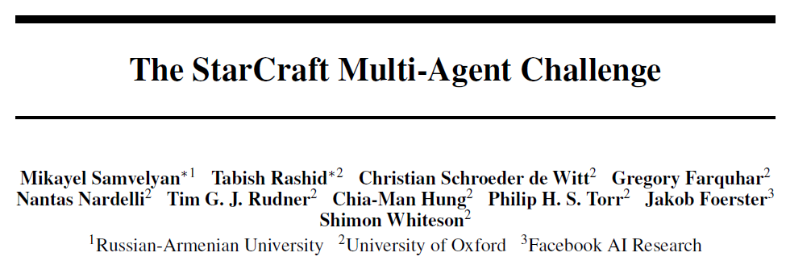

# 0. Abstract

Deep MARL은 활발한 연구가 되고 있는 분야이다. 특히 그중에 주목받고 있는 분야는 Partially observable, cooperative, multi-agent learning이다. 각 Agent는 private observations에만 기반해 행동을 선택해야한다. 이러한 문제는 실제 시스템에 적용이 가능하고 general-sum 문제에 비해 평가가 용이하다는 점에서 매력적인 연구 주제이다.

Single agent RL는 ALE나 MuJoCo같은 표준화된 환경이 있지만 cooperative multi-agent RL의 경우 벤치마크가 없어 일회성의 실험만 진행해야했다. 그로인해 실질적인 연구가 나아가기 힘들었다.

이러한 문제를 해결하기 위해 StarCraft Multi-Agent Challenge (SMAC) 벤치마크를 제안한다. 각 유닛은 독립적인 Agent로 제어되고, local observation 만으로 행동한다.

---

# 1. Introduction

## 1.1 Why MARL is needed?

Deep RL은 사용자가 행동을 명확히 표현할 수 있는 보상 함수를 세울수만 있으면 순차 의사결정 문제를 해결할 수 있다는 점에서 많은 주목을 받았다. 하지만 <u>실제 세계의 문제는 MARL적인 특성을 갖는다.</u> 따라서 decentralisation constraints와 많은 agents의 지수적으로 증가하는 joint action space를 해결할 수 있는 MARL solution의 개발이 필수적이다.

그 중에서도 partially observable, cooperative, multi-agent learning 문제는 흥미로운 연구 분야다. cooperative 문제는 general-sum 게임의 평가의 어려움을 피할 수 있고, 하나의 사용자가 전체 goal을 구체화할 수 있는 distributed system을 관리하는 문제에도 적합하다. 실제 세계에서는 센서의 제한으로 partial observability가 있어서 <u>효율성이 중요</u>하고 커뮤니케이션의 한계도 있어서 <u>학습된 정책의 decentralised execution을 필요로한다.</u>

<u>제어된 환경이나 시뮬레이션에서의 학습은 추가 정보를 사용할 수 있어 이러한 문제에서 벗어날 수 있다.</u>

## 1.2 Why Benchmark is needed?

Single Agent RL 분야에서는 ALE나 MuJoCo와 같이 표준화된 환경이 있어 연구에 큰 진전이 있었다. 하지만 MARL 분야에서는 표준화된 벤치마크가 없다는 문제가 있다. 이로 인해 <u>연구자들은 각자가 생각해낸 환경에서 일회성 실험을 진행해야 하고 이 환경은 지나치게 단순하거나 제안된 알고리즘에 최적화되어 있을 수 도 있다는 문제</u>가 있다.

## 1.3 StarCraft Multi-Agent Challenge (SMAC)

이 논문은 이러한 문제를 해결하기 위해 StarCraft Multi-Agent Challenge (SMAC)를 제안한다. SMAC는 전체 게임은 centralized 제어로 진행대신 decentralised micromanagement challenges에 초점을 맞춘다. 각 유닛은 독립적인 학습 Agent가 local observation만을 기반으로 행동을 결정하면서 제어한다. 상대 유닛은 내재된 AI로 제어된다. 또한 high-dimensional inputs, partial observability, fully decentralised execution에서 coordinated 행동을 학습할 수 있는 다양한 시나리오를 제공한다.

기존의 DeepMind의 Alphastar는 centralised controller를 통해 인상적인 수준의 플레이를 보여줬다. 하지만 SMAC는 전체 게임에서 사용할 Agent를 학습하는 환경이 아니고 strict decentralisation과 local partial observability를 도입해 non stationarity, credit assignment, joint actions value representing 같은 문제를 포함할 수 있는 환경을 제안한다.

---

# 4. SMAC

RTS 게임에는 다음 두 가지가 있다.

1. Macromanagement : 자원과 경영같은 전략적 의사결정하는 것
2. Micromanagement : 개별 유닛을 세밀하게 제어하는 것

SMAC에서는 다양한 Multi Agent testbed를 구축하기 위해 Micromanagement에만 초점을 맞춘 환경을 제안한다.

SMAC에서는 Micromanagement의 Multi-agent적인 특성을 할용해 decentralised 제어 구조를 위해 특별히 설계된 문제를 제안한다. 특히, 각 유닛은 독립적인 Agent가 제어하고 각 유닛은 local observation만을 볼 수 있다. 이러한 Agent들은 게임에 내제된 AI가 제어하는 유닛을 상대로 전투 시나리오를 해결하도록 훈련되어야 한다.

전투 중 유닛을 제대로 제어한다는 것은 최소한의 피해로 최대한의 적 유닛을 제거하는 것이다. 이를 위해 다양한 micro한 기술이 필요하다. 예를 들어 `Focus Fire`, `avoid Overkill`, `kiting` 등이 있다.

SMAC의 환경과 시나리오는 복잡하고 cooperative한 행동을 학습해야 하기 때문에 MARL 알고리즘의 효율성을 평가하기에 좋은 환경이다. 시뮬레이션 환경은 추가적인 state information을 제공하고 이것은 centralised 학습 체계를 활용하는데 중요한 역할을 한다. 또한 SMAC은 partial observability, challenging dynamics, high-dimensional observation spaces 등을 포함하는 도전적인 환경이다.

---

### Scenarios

SMAC는 StarCraft2의 Micro 시나리오로 구성되어 있고 개별 Agents가 복잡한 task를 해결하기 위해 coodination을 학습할 수 있는지를 평가한다.

각 시나리오는 하나 이상의 micromanagement 기술을 학습해야 이길 수 있게 설계되어 있다. 각 시나리오에서는 두 부대가 전투를 하고 각 부대의 초기 위치, 수, 유닛, 지형은 서로 다르다. 첫번째 부대는 학습된 Agent가 제어를 하고 두 번째 부대는 게임 내의 AI가 제어한다.

각 에피소드 시작시 게임 AI는 공격 명령을 내린다. 에피스도는 두 부대중 하나가 전멸하거나, 제한 시간에 도달하면 종료된다. 목표는 승률을 극대화하는 것이다.

---

### State and Observations

각 timestep마다 agent는 시야 범위내에 있는 local observation을 받는다.

이 시야는 각 유닛을 중심으로 원형 반경 영역을 기준으로 시야 범위 값은 9이다. 따라서 환경은 각 Agent 관점에서 partially observable 환경이 된다. Agent는 시야 범위 내에 있고 살아 있는 유닛만 볼 수 있고 죽거나 너무 멀리 떨어진 유닛은 볼 수 없다.

각 Agent가 가지고 있는 feature vector에는 `distance`, `relative x`, `relative y`, `health`, `shield`, `unit_type` 을 포함한다.

Shield도 체력 앞에 공격을 방어하는 보호막으로 프로토스 유닛은 모두 shield가 있고, 일정 시간 피해를 입지 않으면 자동으로 회복된다. 추가적으로 Agent는 시야 범위 내에 있는 아군 유닛의 마지막 행동도 볼 수 있다. 또한, height와 walkability를 포함한 주변 지형 정보를 볼 수 있다.

global state는 centralised training 중에만 접근이 가능하고 맵 상의 모든 유닛의 정보를 알 수 있다. global state vector는 맵 중앙 기준 모든 유닛의 좌표, 관측된 유닛 정보, Medivac의 에너지, 아군 유닛의 cooldown, 모든 Agent의 마지막 action 등을 포함한다. 이때 모든 feature 값은 최대값을 기준으로 정규화되어 사용된다.

---

### Action Space

Agents가 선택할 수 있는 discrete action 집합은 다음과 같다.

`move[direction]`, `attack[enemy_id]`, `stop`, `no-op`

Medivac 같은 힐러 유닛은 `attack[enemy_id]` 대신 `heal[agent_id]`를 사용한다.

각 Agent가 가질 수 있는 최대 행동 수는 시나리오에 따라 7~70개 까지 가질 수 있다.

decentralised execution을 보장하기 위해 Agent는 `attack[enemy_id]` 는  적 유닛이 시야 범위 내에 있으면서 사정 거리 안에 있을 때만 사용할 수 있다. 모든 유닛의 사정 거리는 6, 시야 범위는 9로 설정되어 있다. 이처럼 시야 범위가 사정 거리보다 넓기 때문에, Agent는 공격 전에 `move` 명령을 활용해야 한다.

### Rewards

종합적인 목표는 각 전투 시나리오에서 승률을 극대화 하는 것이다. 보상의 기본 설정은 shaped reward를 사용한다. shpaed reward는 적 유닛에게 가한 체력 피해, 적 유닛 처치, 전투 승리 시 특별 보너스를 기준으로 보상을 제공한다.

정확한 값은 다양한 플래그를 통해 설정이 가능하지만 공정한 비교를 위해 모든 시나리오에서 shaped reward 사용을 권장한다. 또한 다른 옵션인 sparse reward도 제공한다. (승리시 +1, 패배 시 -1)

# 6. Results

이렇게 구현된 환경에서 알고리즘의 성능을 비교한다.

IQL, COMA, VDN, QMIX 그리고 heuristic AI를 비교하는데 heuristic AI는 가장 가까운 적을 선택해 공격하고 그 유닛이 죽으면 바로 옆에 있는 유닛을 공격하는 방식이다. 

heuristic이 비교적 낮은 성능을 보이는 것은 SMAC의 시나리오가 단순히 가장 가까운 적을 공격하는 것만으로는 해결하기 어렵다는 것을 보여준다. 비교 결과 QMIX가 가장 좋은 성능을 보였다.

시나리오에 따라 Easy, Hard, Super-Hard 세가지 범주로 나눌 수 있다.

IQL과 COMA는 Easy 시나리오에서도 좋지 못한 성능을 보였다. 대체적으로 QMIX가 가장 좋은 성능을 보이는 것을 확인할 수 있다.

# 7. Conclusion and Future Work

이 논문은 MARL을 위한 벤치마크로 SMAC를 제안한다. <u>SMAC는 decentralised micromanagement tasks에 초점을 맞춰 14개의 다양한 전투 시나리오를 제공하고 이를 통해 partial observability와 high-dimensional inputs를 요구하는 MARL의 기법을 시험할 수 있게 한다.</u> 또한 standardised performance metrics를 활용한 evaluations reporting을 제안하고 QMIX나 COMA 같은 MARL 알고리즘들에 대한 자세한 보고와 논의를 제공한다.

미래에 더 다양하고 도전적인 시나리오를 추가할 계획이다. 더 다양한 유닛과 더 높은 수준의 Agent간의 coordination이 요구되는 Task를 추가할 계획이다. 특히 StarCraft2 유닛들의 특성과 지형을 활용하는 시나리오를 도입할 예정이다. 이처럼 더 어려운 coordination 문제를 통해 기존 MARL 접근법의 한계를 탐색하고, 특히 multi-agent exploration과 coordination 영역에서의 추가 연구 활성화를 기대한다.

[맨 위로 이동하기](#){: .btn .btn--primary }{: .align-right}
