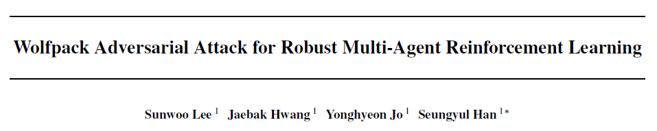

# 0. Abstract

MARL에서 기존의 robust한 방법은 <u>cooperative 시나리오에서 coordinated adversarial attacks에 취약한 점</u>이 있었다.

이러한 한계를 극복하기 위해 Wolfpack Adversarial Attack 프레임워크를 제안한다. Wolfpack 전술은 <u>initial target agent와 그 표적을 돕는 agent의 협력을 방해하는 방식</u>이다.

또한 제안된 Wolfpack attack에 대응해서 시스템 전반의 협력을 촉진함으로써 robust한 MARL 정책을 학습하는 WALL(Wolfpack-Adversarial Learning for MARL) 프레임워크를 도입한다. 실험 결과 Wolfpack attack의 효과와 WALL의 상당한 robustness 향상을 보여준다.

---

# 1. Introduction

partially observable 환경을 다루기 위해 CTDE(Centralized Training and Decentralized Execution) 프레임워크을 사용했다. global value function을 centralized하게 학습하는 동시에 각 Agent는 local observation에 기반해서 정책을 실행했다.

CTDE의 credit assignment를 해결하기 위한 방식으로 VDN, QMIX, QPLEX 등이 있었다. 하지만 CTDE에는 비효율적인 탐색(exploration)과 학습 환경과 실제 환경의 불일치로 인한 예상치 못한 agent의 행동 및 성능 저하라는 문제가 있었다. 그래서 CTDE의 robustness 향상은 중요한 연구로 남아있었다.

single-agent RL에서는 game theory 기반(Max-Min, adversarial learning)으로 <u>robustness를 향상시키려고 했다. 하지만 multi-agent 시스템에서는 agent의 동시 상호작용으로 인해 추가적인 불확실성</u>이 있었다.

이를 해결하기 위해 다양한 방식이 제안됐지만 대체로 single-agent를 타겟으로 한 방식이었다. 이러한 방식은 cooperative한 MARL Agent의 상호의존성을 간과해 여러 Agent를 동시에 공격하는 시나리오에는 취약했다.

이 논문은 이러한 취약성을 활용한 `Wolfpack coordinated adversarial attack` 프레임워크를 제안한다. 이 전략은 <u>특정 Agent를 타겟으로 정하고 그 후에 타겟 Agent를 돕는 그룹을 순차적으로 공격함으로써 Agent 간의 협력을 붕괴시켜 더 큰 피해를 일으키는 방식</u>이다.

실험 결과 기존의 robust MARL 방법들은 이러한 협동적인 공격에 취약함을 보였고, 새로운 방어 전략의 필요성을 보였다. 이를 위해 `WALL(Wolfpack-Adversarial Learning for MARL)` 프레임워크를 제안한다. 이것은 Wolfpack Adversarial Attack에 대응하기 위해 설계된 방법으로 특정 Agent에 의존하지 않고 시스템 전체의 협력을 유도해 조직적인 공격에 효과적으로 대응할 수 있다.

실험 결과 WALL은 기존 방법들과 비교하여 robustness를 크게 향상시키면서도 다양한 공격 시나리오에서도 좋은 성능을 보인다.

이 논문에서 제안한 방식인 Wolfpack Adversarial Attack의 핵심은 다음과 같다.

- 새로운 MARL 공격 전략인 `Wolfpack Adversarial Attack`을 제안한다. 여러 Agent를 동시에 타겟으로 정해서 정책 학습 과정에서 더 강력하고 탄력있는 협력을 유도한다.
- `The follow-up agent group selection`을 제안해 initial attack에 대해 행동 변화가 큰 Agent를 식별하고 이를 순차적으로 공격해 전체적인 영향을 증폭시킨다.
- `A planner-based attacking step selector`를 통해 공격으로 인한 미래 Q-value 감소를 예측하고 효과를 극대화할 시점을 선택해 학습 robustness를 향상시킨다.

---

# 4. Methodology

## 4.1 Motivation of Wolfpack Attack Strategy

(a)에서 t에서 Agent 하나가 공격받는다.

(b)는 t+1에 다른 Agent들이 힐을 하거나 보호하는 위치로 이동하는 등의 방식으로 공격받은 Agent를 돕는다.

반면 (c)는 이러한 반응을 보이는 Agent들까지 연쇄적으로 공격하는 조직적인 공격 전략을 보여준다.

이러한 공격 방식은 기존에 학습된 정책을 무력화하고 공격에 효과적으로 대응하지 못하게 한다. 이는 협력적인 공격이 기존의 공격 방식보다 훨씬 더 치명적이고, 현재의 robust 정책들은 이런 공격에 대응하지 못한다는 것을 보여준다.

(c)에서 처럼 initial attack에 반응하는 Agent들을 공격하는 것이 Wolfpack Attack 전략이다. 이것을 협력적 Multi-agent 환경에 맞게 변형해 Agent 하나를 공격한 뒤, 이에 반응하는 Agent 그룹까지 순차적으로 공격하는 조직적인 전략으로 정의한다.

이러한 방식을 활용해 Wolfpack 공격에 효과적으로 대응할 수 있는 robust한 정책을 개발해 학습 과정 전반의 탄력성을 향상시키려고 한다.

## 4.2 Wolfpack Adversarial Attack

Wolfpack attack은 두가지 요소로 구성된다.

- `initial attack`: 특정 시간 $$t_{init}$$에 single agent를 표적으로 정한다.
- `follow-up group attack`: $$t_{init} + 1$$ 부터 $$t_{init} + t_{WP}$$까지 initial attack에 반응한 Agent 그룹을 순차적으로 공격한다.

에피소드 전체에서 실행 가능한 최대 Wolfpack 공격 횟수는 $$K_{WP}$$로 총 공격 스텝 수는

$$K = K_{WP} \times (t_{WP} + 1)$$로 계산할 수 있다.

### Definition 4.1 (Wolfpack Adversarial Attacker)

Wolfpack adversarial attacker는 다음과 같이 정의된다.

$$\pi_{adv}^{WP} = S \times A \times N \rightarrow A$$

새롭게 정의되는 $$A$$는 $$\tilde{a}_t = \pi_{adv}^{WP}(s_t, a_t, k_t)$$에 의해 정해진다. 이때 $$\tilde{a}_t^i$$는 공격 당하는 모든 agent에 대해서 $$Q^{tot}$$가 최소가 되게 하는 action을 선택한다.

$$N_{t,\text{attack}}$$은 아래와 같이 정의할 수 있다.

$$k_t = 0$$일 땐 공격하지 않는다. 그러다가 $$t_{init}$$에 agent를 랜덤하게(Uniform distribution) 공격한다. 그 후 $$t_{init} + 1$$ 부터 $$t_{init} + t_{WP}$$ 까지 follow-up하는 agent들을 공격한다.

일반적인 adversarial attack 정책과 마찬가지로 공격을 할 때마다 $$k_t$$는 1씩 감소한다. 이때 $$Q^i$$가 아닌 total value function인 $$Q_{tot}$$를 사용해 공격한다.

Wolfpack attack은 두 가지 핵심 문제가 남아있다.

1. $$N_{\text{follow-up}}$$ 을 어떻게 구성할 지
2. initial attack 시점인 $$t_{init}$$을 언제로 정할 지

## 4.3 Follow-up Agent Group Selection Method

Wolfpack adversarial attacker에서 initial attack인 $$\pi_{adv}^{WP}(s_{t_{init}}, a_{t_{init}}, k_{t_{init}})$$에 반응하는 agent들을 $$N_\text{follow-up}$$ agent 그룹으로 구분짓고 다음 step부터 타겟으로 삼는다.

이를 위해 $$t$$일때 original action과 initial attack의 Q-function 차이를 계산해야한다.

모든 t에 대해서 공격대상이 있을 때 $$\Delta Q_t^{tot} \geq 0$$을 만족한다. 왜냐하면 $$Q^{tot}$$를 최소화 하려는 $$\tilde a_t$$를 선택하기 때문이다.

i번째 agent가 initial attack의 타겟이라고 가정하면  $$\Delta Q_{t_{init}}^{tot}$$를 기반으로 $$Q^{tot}$$를 업데이트할때 CTDE 알고리즘의 credit assignment에 따라 i가 아닌 나머지 Agent에 대해 $$Q^{tot}$$를 증가시키는 방향으로 각 Agent의 $$Q^j$$가 조정된다.

$$\alpha_{lr}$$ : 학습률

initial attack에 대응해서 그들의 정책에 맞게 $$Q^j$$를 조정한다. 그중 변화량이 가장 큰 Agent가 follow-up agent로 식별된다. (i번째 Agent는 이미 공격받아 즉각적인 반응이 어려워 제외한다.)

follow-up agent를 찾기위해 $$\tilde Q^j$$와 original $$Q^j$$를 Softmax 함수를 통해 확률 분포 형태로 변환한다. 이를 통해 정책 간의 차이를 계산하기 쉽게 바꿔준다.

그 다음 KL divergence를 측정해 initial attack 이후 가장 큰 변화가 일어난 m명의 에이전트를 follow-up group으로 선택한다.

## 4.4. Planner-based Critical Attacking Step Selection

Wolfpack 같은 협동 공격에서는 Q-function value $$\Delta Q^{WP}_t$$을 크게 만드는 시점을 타겟으로 삼는 것이 Agent의 회복력과 반응에 더 효과적인 영향을 준다. 그러므로 이를 기반으로 initial attack 시점을 정한다.

initial attack 시점인 $$t$$ 부터 $$t+t_{WP}$$ 까지 Q 감소량을 합한 값이다. 이 $$\Delta Q_t^{WP}$$ 값을 최대화 하는 시점으로 $$t_{init}$$을 정한다.

하지만 모든 시점마다 계산하는 것은 비용이 많이 든다.   
이를 해결하기 위해 stored buffer를 통해 공격에 대한 미래 state와 observation의 trajectories를 Planning하는데 사용한다.

Planning을 하는데 Transformer를 사용한다. Transformer는 sequential learning에서 많이 쓰이고 attention 메커니즘을 통해 효율적으로 학습한다.

Transformer는 replay buffer의 trajectory를 사용해서 environment dynamics P^을 학습하고 이를 통해 미래 state와 observation을 예측한다.

$$\hat{o}$$ : joint observation으로 $$Q^{tot}$$를 계산하는데 사용한다.

각 시점 $$l$$에 대해 행동 $$a_l$$ ~ $$\pi$$를 구하고 $$\tilde s_l = s_t$$ 이다. 이를 입력으로 $$\tilde a_l = \pi^{WP}_{adv}(\tilde s_l, a_l, k_l)$$을 구한다.

그 후 Planner를 통해 Wolfpack attack이 만든 Q-value의 추정값인 $$\hat \Delta Q_t^{WP}$$를 구한다.

이 매커니즘으로 L개의 시점에 대해서 추정값 $$\hat \Delta Q_l^{WP}$$를 구하고 $$t_{init}$$을 구한다.

$$t_{init}$$은 아래 식을 기반으로 해 구할 수 있다.

Step Selection Temperature $$T$$는 initial attack probability의 temperature를 제어하는 하이퍼파라미터이다. $$T$$값이 클수록 공격 시점이 무작위하게 넓게 분포하고, 작을수록 critical step에 집중적으로 공격한다.

$$T=0.1$$일때 값이 가장 큰 곳이 Critical Step이다. 그리고 그곳이 initial attack probability가 가장 높은 지점이다.

## 4.5. WALL: A Robust MARL Algorithm

기존의 다른 robust MARL 방법들과 유사하게 Wolfpack attack에 대응하기 위해 설계된 robust한 정책인 Wolfpack-Adversarial Learning for MARL (WALL) 프레임워크를 제안한다.

이 프레임워크는 Wolfpack attacker $$\pi^{WP}_{adv}$$가 적용된 LPA-Dec-POMDP $$\tilde{M}$$ 환경에서 MARL 수행하면서 학습된다. 또한 VDN, QMIX, QPLEX같은 CTDE 알고리즘들을 활용한다.

앞서 설명한것처럼 initial attack을 선택하고 follow-up agents를 구분해 후속 타겟으로 정해 공격한다.   
이렇게 학습을 반복하면서 $$Q^{tot}$$와 Planning Transformer를 업데이트한다. 

---

# 5. Experiments

Wolfpack Adversarial Attack / WALL 으로 했을 때 승률이 가장 좋게 나타나는 것을 확인할 수 있다.

## 5.4. Ablation Study

제안한 Wolfpack adversarial attack에서 각 구성요소와 하이퍼파라미터의 영향을 평가하기 위해 ablation study를 진행한다.

### Component Evaluation

- Default : 모든 구성 요소를 사용하는 기본 설정
- init. agent(min) : initial 타겟 agent i를 랜덤 선택이 아닌 $$Q^{tot}$$를 최소화하는 방식으로 선택
- Follow-up (L2) : follow-up Agent를 initial target과의 L2 distance를 기준으로 가장 가까운 m명을 선택
- Step (Random) : 제안한 step 선택 방식 대신 무작위로 step을 선택하되 공격 횟수는 동일하게 유지
- Agents & Step (Random)은 follow-up Agent와 Attack step을 랜덤 선택

### Number of Follow-up Agents

Number of Follow-up Agents $$m$$은 follow-up Agent 수를 결정하고 이것이 robustness에 미치는 영향을 분석한다.

서로 다른 m값을 설정해 WALL이 default Wolfpack attack을 얼마나 잘 방어하는지 보여준다.

학습 실패를 유발할 수 있는 과도한 공격을 방지하기 위해 $$m < \lfloor \frac{n − 1}{2}\rfloor$$ 으로 가정한다.

결과적으로 8m 환경에서는

- m이 낮으면 initial attack에 대응하는 몇몇 Agent만 타겟이 돼어 공격의 영향이 낮아져 robust가 낮아진다.
- m = 4일 때 너무 많은 Agent가 타겟이 돼서 학습 성능이 급격히 저하된다.
- m = 3일 때 가장 안정적인 성능을 보여서 default로 설정한다.

MMM 환경에서도 m = 4일 때 가장 좋은 robust를 갖는다.

---

### Step Selection Temperature

Step Selection Temperature $$T$$는 initial attack probability의 temperature를 제어하는 하이퍼파라미터이다.

$$T$$값이 클수록 공격 시점이 무작위하게 넓게 분포하고, 작을수록 critical step에 집중적으로 공격한다.

서로 다른 $$T$$값으로 학습된 WALL 정책이 default Wolfpack attack에 대해 어떻게 대응하는지 보여준다.

$$T$$가 너무 작으면 특정 시점에 공격이 집중돼 다양한 공격에 대한 robust가 낮아진다.

$$T$$가 너무 크면 공격이 균등하게 분산돼 critical step에 효과적으로 공격하지 못해 robust가 낮아진다.

이를 통해 $$T = 0.5$$가 critical step에 타겟팅을 하면서도 robust를 유지하는 밸런스가 맞다고 판단했고 이를 default로 설정했다.

---

# 6. Conclusions

이 논문은 군사 작전에서 사용되는 Wolfpack 전술에서 영감을 얻어 기존 adversarial attacks보다 더 강력한 Wolfpack adversarial attack을 제안한다.

또한 이러한 공격에 효과적으로 대응할 수 있도록 WALL이라는 robust MARL 방법을 제안하고 다양한 SMAC 환경에서 좋은 성능을 증명했다.

종합적으로 WALL 프레임워크는 MARL 알고리즘의 robustness를 향상시켰다는 것을 알 수 있다.

[맨 위로 이동하기](#){: .btn .btn--primary }{: .align-right}
