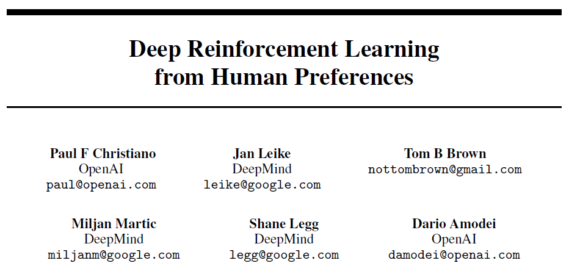

{: width="60%", height="60%"}

1. Deep RL은 일반적으로 수많은 환경과의 상호작용이 필요하다.   
하지만 <u>명시적인 보상 함수를 만들 수 없는 경우 인간이 직접 어떤 것이 더 좋은지 알려주는 방식이 필요</u>하다.
2. 인간의 피드백은 단순히 Agent와 환경이 상호작용하는 것보다 Cost가 훨씬 비싸다.
3. 그렇다면 <u>인간이 제공한 피드백을 바탕으로 보상 모델을 먼저 학습</u>하자.
4. 다음부터는 인간의 피드백이 없어도 보상을 계산할 수 있다.

---

# 0. Abstract

정교한 RL 시스템이 실제 환경과 유용하게 상호작용하기 위해선 시스템에 복잡한 Goal을 전달할 필요가 있다. 이 연구에서는 trajectory segments의 human preference 비교를 통해 정의된 goal을 연구한다.

이 접근법은 명시적인 보상 함수 없이도 Atari 게임 및 시뮬레이션 로봇 보행 등의 복잡한 RL 작업을 효과적으로 해결할 수 있음을 입증한다. 또한 환경과의 상호작용 중 1% 미만의 인간 피드백만으로 학습이 가능하고 RL 시스템에서 인간 감독의 비용을 크게 줄일 수 있음을 보여준다.

---

# 1. Introduction

최근 RL의 성공은 대부분 보상 함수의 명확한 정의가 가능한 것들이었다. 하지만 실제 문제의 보상 함수 정의는 복잡하고 어렵다는 문제가 있다. 이러한 한계를 극복한다면 Deep RL의 활용 가능성이 크게 확장되고 적용 범위도 더욱 넓어질 수 있다.

작업을 수행하기 위한 적절한 보상 함수를 구성하는 것은 쉽지 않다. 단순한 보상 함수를 만들어 원하는 행동을 대략적으로 유도하려고 하면 인간의 의도를 만족시키지 못한 채 보상 함수를 최적화하는 방식으로 행동할 가능성이 크다.

이러한 문제는 RL 시스템의 목표와 인간의 value가 불일치하는 문제가 있을 수 있다. 만약 인간이 원하는 실제 목표를 효과적으로 Agent들에게 전달할 수 있다면 이러한 문제를 해결할 수 있을 것이다.

만약 원하는 작업의 demonstration를 가지고 있다면 Inverse RL을 통해 보상 함수를 추출할 수 있다. 이를 활용해 RL Agent를 학습시키는 방법이 가능하다. 혹은 demonstrated behavior를 따라하는 모방학습을 사용할 수도 있다. 하지만 이러한 <u>접근 방식은 인간이 직접 시범을 보이기 어려운 행동(높은 자유도를 가진 로봇 제어)에 대해 적용하기 어렵다는 한계</u>를 가진다.

또 다른 접근 방식은 RL 시스템이 현재 수행하는 행동에 대해 인간이 피드백을 제공하고 이를 바탕으로 정의하는 것이다. 원칙적으로 이 방법은 RL의 패러다임 안에 포함되지만 인간의 피드백을 직접 보상 함수로 사용하는 것은 실용적이지 않다.

RL 시스템은 오랜 시간의 경험을 필요로 하는데 이러한 긴 학습 과정에서 인간이 일일이 피드백을 제공하는 것은 현실적으로 어렵다. 따라서 인간의 피드백을 이용한 Deep RL 시스템을 효과적으로 훈련하기 위해 필요한 피드백의 양을 줄일 필요가 있다.

이 논문이 제안하는 방식은 인간의 피드백을 통해 보상함수를 만들고 그 보상함수를 최적화하는 것이다. 기존에도 이러한 연구가 있었지만 이 연구에서는 Deep RL에 초점을 맞췄다.

즉, 명확한 보상 함수가 존재하지 않는 sequential decision problems를 해결하는 것이 목표이다. 그와 동시에 아래의 조건들도 만족을 해야한다.

1. 원하는 행동을 인식할 수는 있지만 직접 시범을 보일 수 없는 작업을 해결할 수 있어야 한다.
2. 비전문가도 Agent를 가르칠 수 있어야 한다.
3. 더 큰 문제로 확장 가능해야 한다.
4. 인간의 피드백을 경제적으로 활용할 수 있어야 한다.

---

이 논문에서 제안하는 방식은 인간의 선호도를 학습해 보상 함수를 구성하고 이 보상 함수를 최적화하는 정책을 훈련하는 방식이다. 위 그림을 보면 인간 피드백이 reward predictor로 들어가서 RL 알고리즘에 보상을 제공한다. 이때 인간 피드백은 Agent의 행동을 담은 짧은 영상을 비교해 어느 행동이 더 좋은지를 선택한다. <u>절대적인 숫자로 보상을 제공하는 것이 아니라 상대적인 비교를 통해 피드백을 제공</u>한다.

숫자가 아닌 상대적인 비교로 피드백을 제공하는 방식은 인간이 제공하기 더 쉽고 학습에도 유용하다. 이 방식은 개별 상태를 비교하는 것만큼 빠르면서도 학습된 보상 함수를 더 효과적으로 만들었다.

---

# 2. Preliminaries and Method

## 2.1 Setting and Goal

전통적인 RL에서는 discounted sum of rewards를 최대화하는 것이 목표였지만 이 논문에서는 환경이 reward를 제공하지 않고 인간이 trajectory segment를 비교한다.

Trajectory segment는 observation과 action의 연속적인 시퀀스로 정의된다.

비교 결과 $$\sigma^2$$ 보다 $$\sigma^1$$를 선호하면 $$\sigma^1 \succ \sigma^2$$ 로 표기한다. 

Agent의 목표는 인간이 선호하는 trajectory를 만들면서 동시에 최소한의 human queries만 사용하여 학습하는 것이다.

이렇게 구현된 알고리즘을 Quantitative와 Qualitative 두 가지 방법으로 평가한다.

### Quantitative (정량적)

만약 인간의 선호도가 보상 함수 $$r$$에 의해 생성된다면 보상 함수에 기반해서 높은 reward를 제공한다. 그래서 만약 보상 함수를 알고있다면 qunatitatively하게 평가할 수 있다. 이상적으로는 Agent는 거의 $$r$$을 최적화한 RL을 사용하는 것 만큼의 reward를 달성한다.

### Qualitative (정성적)

보상 함수를 정의할 수 없는 경우에는 human qualitative evaluation를 사용해야 한다.   
인간이 Agent의 성능을 평가하고 영상 자료를 통해 결과를 검토하는 방식으로 정성적 평가를 한다.

---

## 2.2 Out Method

정책 $$\pi: O \to A$$ 와 보상 함수 추정치 $$\hat{r}: O \times A \to R$$ 를 유지하고 각각은 Deep NN에 의해 파라미터화된다. 이 Networks는 세 가지 과정으로 업데이트된다.

1. 정책 $$\pi$$가 환경과 상호작용하여 trajectory를 생성한다. 정책 $$\pi$$의 파라미터는 기존의 RL 알고리즘을 사용하여 업데이트되고 예측된 보상 $$r_t = \hat{r}(o_t, a_t)$$ 의 합을 최대화하도록 학습한다.
2. 단계 1에서 진행된 trajectory로부터 segments를 골라 인간이 비교할 수 있게 한다.
3. 인간이 평가한 비교 데이터를 사용하여 보상 함수 $$\hat{r}$$ 를 지도 학습방식으로 최적화한다.

이러한 과정은 비동기적으로 진행된다.

---

### 2.2.1 Optimizing the Policy

$$\hat{r}$$을 통해 보상을 계산하고 나면 전통적인 RL 문제만 남는다. 이 문제는 각 영역에 맞는 적절한 RL 알고리즘을 사용해 해결할 수 있다.

여기서 보상 함수 $$\hat{r}$$ 가 non-stationary 일 수 있기 때문에 policy gradient methods를 사용하는 것이 더 적합하다. 이 과정에서 보상의 분포를 정규화하여 평균이 0이고 표준 편차가 일정하도록 설정했다.

---

### 2.2.2 Preference Elicitation

사람이 1~2초 길이의 trajectory segments clip을 보고 더 선호하는 것을 선택한다. 이때 두 개가 동등하게 좋은지 혹은 둘을 비교할 수 없는지 선택할 수 있다. 평가한 데이터는 $$(\sigma^1, \sigma^2, \mu)$$ 형식으로 데이터베이스 $$D$$에 저장된다.

---

### 2.2.3 Fitting the Reward Function

추정된 보상 함수 $$\hat{r}$$는 인간의 선호를 확률적으로 예측하는 함수로 해석할 수 있다.

이러한 예측과 실제 인간 레이블 간의 cross-entropy loss를 최소화하도록 $$\hat{r}$$를 선택한다.

이것은 preference pair로 부터 score function을 추정하는 Bradley-Terry 모델을 따른다.

두 trajectory segments의 보상 추정값의 차이는 인간이 그것을 선택할 확률을 의미한다.

제안하는 알고리즘은 이 접근법에 몇가지 사항을 추가한다.

- predictor ensemble을 학습 시킬 때 각 predictor는 $$D$$에서 샘플링한 값으로 학습한다.  $$\hat{r}$$는 predictor들을 독립적으로 정규화한 후 평균낸 값이다.
- 전체 데이터의 $$\frac{1}{e}$$는 각 predictor의 validation set로 따로 분류된다. L2 regularization를 사용하고 regularization coefficient를 조정해서 Validation Loss가 Training Loss의 1.1~1.5배가 되도록 한다.  일부 도메인에서는 Dropout을 사용하기도 한다.
- 위의 인간의 선호의 확률을 예측하는 함수 계산식에서 직접 softmax를 적용하는 것이 아니라 인간이 랜덤하게 응답할 확률이 10%가 있다고 가정한다. 이것은 보상의 차이가 아무리 커도 인간 평가자가 실수할 확률이 있을 수 있다는 것을 반영한다.

---

### 2.2.4 Selecting Queries

보상 함수 추정기의 불확실성에 대한 근사치를 기반으로 어떤 것을 쿼리를 할지 결정한다. 길이가 k인 trajectory segments Pair를 많이 샘플링한 뒤 ensemble에 속한 각 보상 estimator를 사용해 각 Pair에서 어떤 segment를 더 선호할지 예측한다. 그 후 ensemble 멤버 중에 분산 추정치가 가장 높은 trajectories를 선택한다.

---

# 3. Experimental Results

## 3.1.1 Simulated Robotics

{: width="60%", height="60%"}

MuJoCo 환경에서 8개의 Task를 수행했다. 700개의 Synthetic queries를 사용한 학습 결과 대부분의 작업에서 RL과 거의 동등한 성능을 보였고 1400개의 Synthetic queries를 사용했을 때는 실제 보상을 받았을 때보다 약간 더 좋은 성능을 보이는 것도 있다.

## 3.1.2 Atari

{: width="60%", height="60%"}

Atrai Game 환경에서 7개의 게임을 진행했다. 5500개의 Human labels를 사용했을 때 일부 게임에서는 RL과 거의 동등한 성능을 보이고 일부 게임에서는 성능이 낮았다.

## 3.2 Novel behaviors

전통적인 RL Task에서는 효과적임을 확인했지만 궁극적인 목표는 보상 함수가 없는 Task를 해결하는 것이다. 이전 실험과 같은 파라미터를 사용하면서 새로운 복잡한 행동을 학습할 수 있는 것을 확인했다. Hopper robot의 백플립, Half-Cheetah의 한발 이동 등등

## 3.3 Ablation Studies

1. Random Queries - query를 무작위로 선택.
2. No Ensemble - 여러 개의 estimator를 사용하지 않고 단일 estimator로 학습
3. No Online Queries - 학습 초기에 수집한 query만을 사용해 학습.
4. No Regularization - L2 Regularization를 제거하고 dropout만 사용.
5. No Segments - robotics tasks에서 길이가 1인 trajectory segments 사용
6. Target - trajectory segent의 총 보상을 알려주는 Oracle을 사용.

MuJoCo 환경

{: width="60%", height="60%"}

Atari Game 환경

{: width="60%", height="60%"}

---

# 4. Discussion and Conclusions

Agent와 환경간의 상호작용은 종종 인간과의 상호작용보다 비용이 훨씬 저렴하다. 지도학습을 사용해 별도의 보상 모델을 학습해 상호작용 복잡도를 약 1000배를 줄일 수 있다.
이것은 인간의 선호도를 활용해서 Deep RL Agent를 효과적으로 학습할 수 있고 샘플 효율성 향상을 통해 returns이 줄어드는 구간에 진입했다. 즉, 계산 비용이 이미 비전문가의 피드백 비용과 비슷한 수준에 도달했다.

[맨 위로 이동하기](#){: .btn .btn--primary }{: .align-right}
