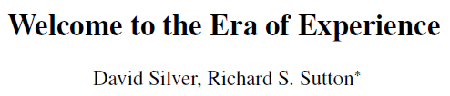

이 논문은 연구적인 측면보다 현재까지의 시대부터 앞으로 등장할 시대까지의 모습에 대해 예측한 글이다. 그래서 주로 "~할 것" 처럼 예측에 대한 부분이 많기는 하지만 한 번 읽어보면 좋을 것 같다고 생각이 들었다.

두 분 모두 RL 분야의 대가들이니까 앞으로의 방향성에 대해서 이럴 수도 있겠구나 생각해보면 좋을 것 같다.

---

# 0. Abstract

현재 전례 없는 수준의 능력을 가진 AI 시대로 가는 경계에 놓여있다.   
Agent의 새로운 시대는 Experience를 통해 학습해 인간을 넘어서는 능력을 가질것이다.   
이 논문은 다가올 시대의 핵심 특징에 대해 알아본다.

---

# 1. The Era of Human Data

AI는 최근 몇 년간 많은 양의 human Data를 통해 학습하고 전문가의 fine-tuning으로 발전했다. 이러한 방식의 대표적인 예는 LLM이 있다. 이제 하나의 LLM이 시를 쓰고 물리 문제를 풀고 의료 진단을 하고 법률 문서를 요약한다.

인간을 모방하는 것으로 인간 능력을 능숙한 수준까지 올릴 수 있지만 이 방식만으로는 여러 중요 task에서 인간을 넘어서는 성능을 달성할 수 없을 것이다. 특히 수학, 코딩, 과학과 같은 중요 도메인에서 human data로부터 추출할 수 있는 지식이 빠르게 한계에 다다르고 있다. agent의 성능을 향상시킬 수 있는 고품질의 데이터는 대부분 소모됐거나 고갈될 것이다.

따라서 human data 기반의 지도 학습의 발전 속도는 느려지고 있고 새로운 방식의 필요성이 생겨나고 있다. 게다가 새로운 이론, 기술, 과학적 혁신같은 인사이트는 인간 이해의 범위를 넘어서는 영역에 있어 기존의 human data만으로는 알수가 없다.

---

# 2. The Era of Experience

더 큰 진전을 위해서는 <u>새로운 형태의 데이터가 필요</u>하다. 이 데이터는 agent도 점점 강력해지기 때문에 지속적으로 향상되어야 한다. 이러한 데이터 생성은 agent가 env와 상호작용하면서 자신의 경험으로부터 지속적인 학습으로 실현될 수 있다.

<u>현재 AI는 경험이 주요 수단이 되고 궁극적으로 현재 시스템이 사용하는 Human Data의 규모를 압도하게 될 새로운 시대의 경계에 서 있다.</u>

이러한 전환은 LLM 분야에서 이미 시작되었을 수도 있다. 예를 들어 AlphaProof는 기존 수학자들이 만든 10만 개의 formal proofs를 학습하고 RL 알고리즘을 통해 1억개 이상의 proofs를 스스로 생성했다.

이처럼 상호작용 중심의 경험에 집중함으로써 AlphaProof는 기존 증명의 경계를 넘어서는 수학적 가능성을 탐색하고 새롭고 도전적인 문제들에 대한 해법을 발견할 수 있었다.

최근에 나온 DeepSeek에서는 “RL의 힘과 아름다움은 모델에게 문제 해결 전략을 직접적으로 가르쳐 주지 않아도 적절한 인센티브만 제공하면 학습 과정에서 모델이 자율적으로 발전된 전략을 탐색하고 개발하는 점에 있다.”라고 했다.

경험적 학습의 잠재력이 완전히 활용될 때 놀라운 새로운 능력이 등장할 것이라고 확신한다. 이러한 Era of Experience는 다음과 같은 특징을 가질것이다.

오늘날의 기술은 알고리즘만 적절히 선택한다면 이러한 돌파구를 실현하기에 충분한 강력한 기반이 있다고 생각한다.

---

# 3. Streams

Experiential agent는 일생동안 학습을 진행할 수 있다. Human data 시대에 언어 기반 AI는 Q&A 같은 짧은 상호작용 에피소드에 주로 집중을 했다. 그래서 agent가 다음 에피소드로 가지고 갈 정보가 적거나 거의 없었고 적응을 할 시간도 없었다. 

이에 반해 인간은 수년에 걸쳐 지속되는 action이나 observation의 stream에 존재한다. 정보는 전체 stream을 통해 전해지고 그들의 행동은 과거의 경험으로부터 더 발전시킨다. 심지어 인간은 건강, 언어 학습 같은 장기 목표를 이루기 위한 action을 선택한다.

강력한 agent는 인간처럼 그들만의 긴 stream을 가져야만 한다. 이것은 agent가 미래 goal을 성취하기 위한 action을 하도록 하고 행동 패턴에 적응할 수 있다.

agent는 설정한 장기 목표의 성공을 극대화하기 위해 일련의 단계를 진행한다. 개별적인 단계는 즉각적인 이익을 주지않거나 단기적으로 해가 될 수 있지만 결과적으로는 장기 목표 성공에 기여할 수 있다. 이는 action이 env에 미치는 미래의 영향을 측정하거나 최적화할 능력 없이 요청에 즉시 응답하는 현재의 AI 시스템과 극명한 대조를 보여준다.

---

# 4. Actions and Observations

The Era of Experience에 있는 agent는 real world에서 자율적으로 행동할 것이다. human data의 시대에 존재한 LLM은 주로 사람에게 특권화된 action과 observation에 집중했다. 즉 사용자에게 텍스트를 출력하고 사용자로부터 텍스트를 입력받는 방식이다. 

LLM이 디지털 세계에서 API를 호출하는 등의 행동을 할 수 있다는 점은 오래전부터 인식되어 왔다. 처음에는 이러한 능력이 대부분 도구 사용에 관한 인간의 예시에서 비롯되었지 agent 자신의 경험으로부터 나온 것은 아니었다.  
하지만 코딩 및 도구 사용 능력은 점점 execution feedback을 기반으로 발전해 왔다. 즉, agent가 실제로 코드를 실행하고 그 결과를 관찰하는 것이다.

최근에는 새로운 agent들이 컴퓨터를 인간과 동일한 인터페이스로 조작하면서 더 일반적인 방식으로 컴퓨터와 상호작용하기 시작했다. <u>이러한 변화는 인간 중심적인 커뮤니케이션에서 벗어나 agent가 더 독립적으로 행동할 수 있는 더 자율적인 상호작용으로 전환한 것</u>이다. 이를 통해 더 능동적으로 탐색하고 변화하는 환경에 적응해 인간에게 떠오르지 않는 전략을 발견할 수 있다.

더 자율적인 상호작용은 agent가 디지털 세계를 자율적으로 이해하고 제어할 수 있는 수단을 제공한다. agent는 사용자 인터페이스와 같은 인간 친화적인 action과 observation을 사용할 수 있고 이것은 사용자와 자연스러운 소통 및 협업을 가능하게 한다. 또한 agent는 코드를 실행하거나 API를 호출하는 기계 친화적인 행동을 통해 자신의 goal을 향해 자율적으로 행동할 수도 있다.

경험의 시대에는 agent가 디지털 인터페이스를 통해 현실 세계와도 상호작용할 것이다. 예를 들어 과학 agent는 환경 센서를 모니터링하거나 원격으로 망원경을 조작하거나 실험실에서 로봇 팔을 제어하여 자율적으로 실험을 수행할 수 있다.

---

# 5. Rewards

경험 기반 agent가 인간의 선호뿐만 아니라 외부의 사건과 신호로부터도 학습할 수 있다면 어떨까?

인간 중심의 LLM은 일반적으로 human prejudgement에 기반한 보상을 최적화한다. 즉, 전문가가 agent의 행동을 관찰하고 그것이 좋은 행동인지 판단하거나 여러 대안 중에서 가장 좋은 행동을 선택한다.

이러한 보상이나 선호가 행동의 실제 결과를 측정하는 것이 아니라 인간이 결과 없이 판단하는 방식으로 결정되기 때문에 세상의 실제 현실에 직접적으로 근거하지 않는다. 이러한 human prejudgement에 의존하는 방식은 agent의 성능에 분명한 한계를 가져온다. 인간 평가자가 과소평가하는 더 나은 전략을 agent가 발견할 수 없게 만든다.

기존의 인간 지식을 넘어서는 새로운 아이디어를 발견하기 위해서는 grounded rewards를 사용하는 것이 필요하다. 즉, 환경 자체에서 발생하는 신호를 기반으로 해야 한다. 예를 들어 건강 보조 agent는 사용자의 건강 목표를 심박수, 수면 시간, 활동 수준과 같은 신호의 조합으로 된 보상으로 전환할 수 있다.

이러한 grounded rewards는 agent의 환경에 있는 인간으로부터 발생할 수도 있다. 예를 들어 인간 사용자가 케이크가 맛있었는지 운동 후 얼마나 피곤했는지 두통의 통증 수준이 어떤지로 할 수 있다.

reward가 human data가 아니더라도 agent가 action과 observation를 통해 세계와 연결된다면 reward로 설정할 grounded signal은 많이 있다. (예를 들면 비용, 생산성, 이익)

→ 정리하자면 언어를 배우는데 A 강사의 교육 방식이 맘에 든다(human prejudgement)라고 인간이 판단 했지만 B 강사의 수강생의 시험 성적(grounded rewards)이 더 좋았다고 하면 인간의 선호가 어찌됐든 언어 학습이라는 기준에서는 B 강사의 방식이 맞다고 판단할 수 있다. 이런식으로 이해할 수 있을듯

그 외에도 특정 사건의 발생이나 관찰·행동의 원시 시퀀스로부터 유도된 특징들도 신호가 될 수 있다. 이를 통해 grounded signal을 보상으로 삼는 다양한 agent를 만들 수 있다.

하지만 grounded signal로 보상을 판단한다 해도 “좋은 글”을 어떻게 판단할 수 있을까?   
<u>결국 인간의 판단을 받을 수 밖에 없다는 것</u>이다. 그래서 bi-level optimization을 설명한다.

- top-level goal은 사용자 피드백을 최적화하는 것
- low-level은 env에서 나온 ground signal을 최적화하는 것

이 방식을 통해 소량의 human data로도 대규모의 자율 학습을 촉진할 수 있다.

---

# 6. Planning and Reasoning

The Era of Experience가 agent가 plan과 reason하는 방식도 변화시킬 수 있을까?

최근에는 LLM이 언어를 사용해 reason하거나 think할 수 있도록 하는 방식에서 큰 발전이 있었다. 이 방식은 LLM이 응답을 출력하기 전에 일련의 사고 과정을 따르게 하는 것으로 chain of thought (CoT)라고 한다.

개념적으로 LLM은 범용 컴퓨터처럼 작동할 수 있다. 자신의 컨텍스트에 토큰을 계속 추가하면서 임의의 알고리즘을 실행하고 최종 결과를 출력할 수 있다.

human data의 시대에서는 이러한 추론 기법들이 인간의 사고 과정을 모방하도록 설계되었다. 하지만 인간 언어가 가장 효율적인 사고 방식은 아닐것 이므로 universal computer의 최적 형태라고 보기는 어렵다. Self-Learning 시스템은 경험을 통해 그러한 사고 방식을 스스로 발견하거나 개선할 수 있다.

또한 universal computer라는 개념은 agent 내부의 계산 능력만 설명할 뿐 그것이 외부 세계와 어떻게 연결되는지는 설명하지 않는다. 만약 agent가 인간의 사고나 전문가의 정답을 흉내 내도록만 훈련된다면 그 데이터에 깊이 뿌리내린 잘못된 전제나 편향된 사고 방식을 그대로 이어받을 위험이 있다.

이처럼 각 사고 방식에서 한 단계 나아가기 위해서는 real world와의 상호작용이 필요하다. 마찬가지로 agent 역시 현실 세계의 데이터에 기반해야만 잘못된 사고 방식을 극복할 수 있다.

이런 grounding은 피드백 루프를 만들어 agent가 자신이 배운 가정을 실제와 비교하고 현재의 인간 사고 방식에 얽매이지 않고 새로운 원칙을 발견할 수 있게 한다. 현실 기반이 없다면 아무리 정교한 agent라도 echo chamber에 머물게 된다.

이를 넘어서는 방법은 agent가 세상과 능동적으로 상호작용하고 관찰 데이터를 수집하며 그 데이터를 사용해 자신의 이해를 점진적으로 다듬는 것이다. 이는 결국 인간의 과학적 진보 과정과 매우 유사하다.

그렇다면 agent는 real world와 어떻게 상호 작용할 수 있을까?

그 방법중 하나는 World Model을 구축하는 것이다. 이렇게 되면 agent의 행동이 세상에 미치는 영향을 예측할 수 있고 보상 역시 예측할 수 있다. 이러한 예측 능력은 agent가 자신의 행동과 그것이 세상에 미치는 인과적 효과를 바탕으로 직접 planning을 할 수 있게 해준다. 그리고 agent가 경험을 쌓으며 세상과 계속 상호작용할수록 이 dynamics model은 스스로 예측 오차를 수정하며 점점 정교해진다.

이처럼 world model이 주어지면 agent는 확장 가능한 plan 알고리즘을 적용해 예측된 성능을 향상시킬 수 있다.

---

# 7. Why Now?

경험을 통한 학습은 새로운 개념은 아니다. 과거에도 RL 시스템은 보상이 명확히 정의된 Simulator 내에서 매우 복잡한 과제를 성공적으로 해결해 왔다. (Era of Simulation) (ex: 바둑, 체스, 아타리, 스타, 도타 등등)

AlphaZero 같은 강력한 RL agent는 NN의 size, interactive experience, thinking time이 늘어날수록 성능이 좋아지는 확장성도 보여줬다.

하지만 <u>이러한 방식의 agent는 Simulation(closed problems, 명확한 보상)에서 reality(open-ended problems, 불분명한 보상)으로 도약하지는 못했다.</u>

이때 해결방법으로 등장한 Era of Human Data였다.

많은 양의 human data에 있는 다양한 자연어 사용으로 학습된 agent는 더 광범위한 Task가 가능하게 했다.(ChatGPT) 그 결과 경험 기반 RL 방식은 대체되었고 보다 범용적인 인간 중심 AI가 대세가 되었다.

하지만 <u>이 전환 과정에서 agent가 스스로 지식을 발견하는 능력이 사라졌다.</u>

예를 들어 AlphaZero는 체스와 바둑에서 인간이 이전까지 발견하지 못한 새로운 전략을 스스로 찾아냈고 이를 통해 실제로 인간의 게임 방식까지 변화시키는 결과를 낳았다

Era of Experience는 앞선 두 Era의 장점인 Self-discovery 능력과 task generality를 결합하려는 것이다.

이러한 시대는 agent가 현실 세계에서 자율적으로 행동하고 관찰하고 다양한 grounded signals를 통해 보상으로 연결할 수 있을 때 실현 가능하고 점점 현실로 다가오고 있다.

---

# 8. Reinforcement Learning Methods

RL은 agent가 env와의 직접적인 상호작용을 통해 스스로 학습하는 방식이다.   
초기 RL 연구에서 다양한 방법들이 개발되었다. 예를 들어 temporal difference learning은 agent가 미래 보상을 예측할 수 있도록 했고 다양한 탐험 기법은 agent가 새롭고 창의적인 행동을 발견하고 비효율적인 루틴에 갇히는 것을 방지하도록 도왔다.

Dyna 알고리즘과 같은 방법은 agent가 자신의 세계에 대한 모델을 구축하고 그로부터 학습할 수 있게 함으로써 미래 행동에 대한 계획과 추론이 가능하게 했다.

---

하지만 인간 중심의 LLM이 등장하면서 점점 자율적 학습에서 인간 지식의 활용으로 옮겨갔다.

예를 들어 RLHF 혹은 언어 모델을 인간 추론에 맞게 정렬하는 기법들은 매우 효과적이었고 AI 능력의 빠른 발전을 이끌었다. 그러나 이러한 접근은 RL의 핵심 개념들을 종종 우회하거나 생략하게 만들었다

RLHF는 agent가 스스로 예측하는 가치 함수 없이 인간의 피드백을 직접 사용하는 방식으로 동작했다. human data에 기반한 강한 priors는 탐험의 필요성을 줄였고 인간 중심의 사고 방식은 world models이나 temporal abstraction의 필요성 또한 약화시켰다.

결과적으로 인간 중심의 RL은 이전보다 훨씬 폭넓은 행동 능력을 가능하게 했지만 agent가 인간 지식을 넘어서는 능력에는 한계가 있었다. 게다가 human data 중심의 접근은 단기적이고 수동적인 human-agent 상호작용에 적합한 RL 방식에 집중되었고 장기적이고 자율적인 상호작용에는 적합하지 않다.

---

The Era of Experience는 고전적인 RL 개념들을 다시 조명하고 진화시킬 기회를 제공한다.   
이러한 시대에서는 다음과 같은 변화가 예상된다.

- 보상 함수는 observation 데이터를 기반으로 더 유연하고 현실적으로 정의될 수 있다.
- value function은 불완전한 long streams에서 추정될 수 있다.
- exploration은 인간의 선입견과 전혀 다른 새로운 행동을 발견할 수 있는 현실 세계 중심의 원칙적인 방법으로 이루어질 것이다.
- World Model은 현실 기반 상호작용의 복잡성을 반영하여 새롭게 개발
- temporal abstraction 기법은 agent가 experience 관점에서 추론을 할 수 있게 한다.

즉, 강화학습의 핵심 원리들을 경험 기반 학습에 맞게 재정립함으로써 AI는 진정한 자율학습 능력을 갖추고 superhuman intelligence의 문을 열 수 있다.

---

# 9. Consequences

the era of experience는 AI agent가 세계와 상호작용하며 학습하는 새로운 패러다임이고 이는 이전에 본 적 없는 완전히 새로운 미래를 약속한다.   
이러한 시대는 엄청난 가능성을 제공하는 동시에 중대한 위험과 도전 과제도 동반한다.

> 긍정적인 측면으로는 

개인화된 AI 어시스턴트가 장기간에 걸쳐 건강, 교육, 직업적 목표에 맞추어 사용자에게 맞춤형 지원을 제공할 수 있을 것이다.

가장 혁신적인 변화는 아마도 과학적 발견의 가속화일 것이다. AI agent는 신소재, 의약, 하드웨어 설계 분야에서 스스로 실험을 설계하고 수행할 수 있으며, 이러한 실험을 통해 끊임없이 학습함으로써 전례 없는 속도로 새로운 지식과 기술을 개척할 수 있다.

> 부정적인 측면으로는

생산성은 향상되겠지만 그로 인해 일자리 상실이 우려된다. AI는 장기 문제 해결, 혁신, 현실 세계에 대한 깊은 이해 등 기존에는 인간 고유 능력이라 여겨졌던 영역까지 진입할 수 있다.

특히 자율적으로 장기 목표를 추구하는 agent는 사람의 개입이 줄어들기 때문에 높은 수준의 신뢰성과 책임이 요구된다.   
또한 인간 중심 데이터를 벗어남에 따라 AI 시스템이 해석하기 더 어려워질 수 있다.

부정적인 측면가 있지만 이를 커버할 수 있는 안정성의 이점이 있을 수도 있다.

1. 경험 기반 agent는 자신이 놓인 환경을 인지하고 시간이 지나면서 환경 변화에 능동적으로 적응할 수 있다.
2. 경험을 통해 보상 함수 자체를 조정할 수 있다. 이를 통해 잘못 설정된 보상 함수더라도 점차 개선할 수 있다. 
3. 물리적 세계의 한계가 자연적인 속도 조절 역할을 할 수 있다. 실제 약 개발처럼 real world에서의 실행과 검증에는 시간이 필요하므로 AI의 지나친 발전 속도를 제어하는 자연적 제약이 된다.

---

# 10. Conclusion

The Era of Experience는 AI 진화 단계에서 중요한 전환점이다.   
오늘날의 강력한 기반 위에 구축하면서 Human data의 한계를 넘어 agent는 점점 더 자신의 세계와의 상호작용을 통해 학습할 것이다. agent는 많은 observation과 action을 통해 env와 자율적으로 상호작용을 하고 experience stream에서 적응할 것이다.

인간이 사용하는 사고방식에 국한되지 않는 강력한 추론 능력을 활용하고 자신의 action이 env에 미치는 결과로 planning을 할 것이다.

궁극적으로 <u>experiential data는 Human data의 규모나 품질을 넘어설 것이다. 이러한 패러다임의 전환은 RL 알고리즘 발전과 같이 일어나고 여러 분야에서 인간이 가진 능력을 뛰어넘는 새로운 역량을 가질 것</u>이다.

[맨 위로 이동하기](#){: .btn .btn--primary }{: .align-right}
