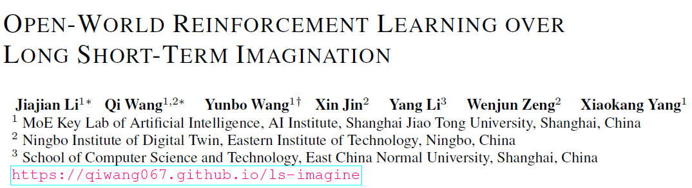

{: width="60%", height="60%"}

일단 LS-Imagine의 알고리즘 동작 순서를 큰 틀로 잡고 각 단계가 어떻게 진행되는지 이해를 하면서 읽어보면 좋을 것 같다.   
그리고 각 단계 원리를 또 설명해주니 이를 통해 이해할 수 있을 것 같다.

핵심적인 부분은 다음과 같다.

1. Affordance map을 만들어 visual observation에서 task-relevant한 부분을 강조해 agent가 효율적으로 탐색하도록 유도
2. short-term, long-term state transition을 모두 고려한 imgaination을 통해 멀리까지 계획이 가능하다.
3. jumping state transition과 modified λ-return을 활용해 정책 학습을 한다.

---

# 0. ABSTRACT

고차원의 open-world 환경에서 visual RL agent를 학습하는 것은 어려움이 있다. 현재 다양한 model-based method를 통해 상호작용 가능한 world model에서 학습해 샘플 효율성을 올렸지만 이러한 agent들은 short snippets of imagined experiences을 기반으로 학습해 근시안적이다.

open-world decision-making에서 가장 큰 문제는 long-horizon payoff을 필요로 하는 task에서 넓은 state space에서의 탐색 효율성을 향상시키는 것이다 

따라서 이 논문은 LS-Imagine을 제안한다. 제한된 state transition steps내에서 imagination horizon을 확장해 agent가 장기적으로 좋은 피드백을 줄수있는 action을 탐색하게 한다. 이 방법의 핵심은 long short-term world model을 구축하는 것이다.

이를 위해 goal-conditioned jumpy state transitions을 시뮬레이션하고 단일 이미지의 특정 영역을 확대해 affordance map을 계산한다. 이를 통해 장기적인 가치를 행동 학습에 직접적으로 통합할 수 있다.

이 방식은 MineDojo 환경에서 기존의 SOTA 보다 좋은 성능을 보였다.

---

# 1. INTRODUCTION

RL에서 open-world decision-making은 아래의 특징을 갖는다.

1. agent는 매우 넓은 state space를 갖는 상호작용 환경에서 동작한다.
2. 학습된 정책의 유연성이 높아 환경 내 다양한 객체와 상호작용이 가능하다.
3. physical dynamics이나 내부의 visibility가 부족하고 환경에 대한 인식은 불확실성을 동반한다.

이러한 특성을 가진 전형적인 예시가 Minecraft이다.

open-world decision-making의 목표는 고차원 visual observation만으로 인간 수준의 근접한 agent를 학습하는 것이다. 하지만 지금까지 나온 방법들은 한계가 있었다.

- Voyager : high-level controller로 Minecraft API를 사용하지만 standard visual control settings와 호환이 안됨
- PPO-with-MineCLIP, DECKARD : low-level visual control을 수행하지만 Model-free RL methods은 환경의 메커니즘을 이해하기가 힘들어 trial-and-error cost가 높고 탐색 및 샘플 사용의 비효율을 초래할 수 있다.
- **DreamerV3 :** Model-based RL(MBRL)을 통해 샘플 효율을 높이지만 근시안적이다.

이러한 MBRL의 행동 학습 효율을 개선하기 위해 Long Short-Term Imagination(LS-Imagine)을 제안한다.이 방식의 핵심은 일일이 1-step prediction을 롤아웃하지 않고도 특정 행동의 장기적 효과를 world-model이 효율적으로 시뮬레이션할 수 있게 하는 것이다.

위의 그림처럼 학습이 된 world model은 instant와 jumpy state transitions, 내재적 보상을 제공해 short- and long-term imagination에서의 정책을 최적화한다. 장기적으로 좋은 결과를 내는 행동을 탐색하도록 agent를 유도한다.

LS-Imagine의 기반은 long short-term world model의 학습이다. 이를 위해 task-specific guidance를 off-policy experience replay에 기반한 representation learning  phase에 통합해야 한다. 하지만 이것은 전형적인 chicken-and-egg 딜레마가 생긴다: 실제로 목표에 도달한 데이터가 없는데 어떻게 현재 상태에서 목표 달성 가능성이 높은 미래 상태로 jumpy transition을 world model이 학습할 수 있을까?

이 문제를 해결하기 위해 single 이미지를 확대해 agent가 목표에 접근할 때 발생할 연속적인 비디오 프레임을 시뮬레이션해 영상을 하나 만든다. 이후 이렇게 생성된 pseudo video가 텍스트 명령에 명시된 목표와 얼마나 관련성이 있는지 평가해 affodance map을 생성한다. (MineCLIP reward model 활용)

그 다음 world model의 특정 branch를 학습해 인접 시간 step간 이미지 쌍과 더 긴 간격의 이미지 쌍을 이용해 instant transition과 jumpy transition을 모두 학습한다. 마지막으로 world model이 생성한 latent states의 유한한 시퀀스에 기반해 agent의 정책을 최적화해 직접적인 long-term values을 decision-making에 통합한다.

위 그림을 예시로 보면 “나무를 잘라라”라는 명령을 받으면 agent는 현재 실제 관측된 상태를 기반으로 가까운 미래를 시뮬레이션한다. 초기에 나무에 근접할 수 있는 long-distance state jump를 찾을 때 까지 여러 번의 single-step rollout을 진행한다. agent는 이 jump를 실행하고 value function을 최대화 할 수 있게 정책 네트워크를 최적화한다.

이 방식을 통해 MineDojo 환경에서 실험해 LS-Imagine이 다른 기존의 visual RL 방법들에 비해 좋은 성능을 내는 것을 확인했다.

이 연구의 기여점은 아래와 같다.

- instant and jumpy state transitions을 모두 캡처해 학습에 활용해 open-world에서 탐색의 효율을 높이는 새로운 model-based RL method를 제안한다.
- 구체적인 기여점은 다음과 같다.
    1. long short-term world model architecture
    2. 이미지 줌인을 통한 affordance maps 생성
    3. affordance maps에 기반한 새로운 형태의 내재적 보상
    4. long-term values를 통합하고 mixed long short-term imagination pathway를 활용하는 학습 방법

---

# 2. PROBLEM FORMULATION AND NOTATIONS

MineDojo를 test bench로 활용해 Visual RL을 POMDP로 해결했다. 특히 이 방법은 고차원의 visual observation과 희박한 보상만을 받아 저차원의 action signal을 만들었다는 것이다. 또한 open-world 게임의 API도 사용하지 않았다.

{: width="60%", height="60%"}

다른 방식들과 비교한 표를 확인할 수 있다.

이 논문에서 world model는 크게 두가지 요소로 나뉜다. short-term transition branch, long-term imagination branch. 그 결과 복잡한 notation system을 사용한다.

- $$M_t$$ : Affordance map
- $$c_t$$ : episode continuation flag
- $$j_t$$ : jumping flag
- $$\Delta_t$$  : the number of environmental steps
- $$G_t$$ : cumulative reward

$$(o'_t, a'_t, M'_t, r'_t, c'_t, j't , \Delta'_t, G'_t)$$로 simulated environment data를 표현하고 world model의 long-term imagination branch를 학습한다.

정책은 mixed long- and short-term imaginations의 trajectories $${(\hat s_t, \hat a_t, \hat r_t, \hat c_t,\hat j_t, \hat \Delta _t, \hat G_t)}$$를 사용해 학습한다. 이때 $$\hat s_t$$는 latent state를 나타낸다. (hat의 경우 모델이 예측한 값)

# 3. METHOD

## 3.1 OVERVIEW OF LS-IMAGINE

LS-Imagine의 알고리즘 단계

1. Affordance map computation
    
    sliding bounding box를 사용해 single 이미지를 스캔하고 bounding box 내부를 연속적으로 확대해 long-distance state transitions에 해당하는 consecutive video frames을 시뮬레이션한다. 그 다음 텍스트로 주어진 task의 목표와 얼마나 관련있는지 평가해 MineCLIP 보상 모델을 활용해 afforance map을 생성한다.
    
2. Rapid affordance map generation
    
    Affordance map은 5단계에서 jumpy state transition 필요성을 평가하는 데 자주 사용하므로 U-Net 모듈을 훈련시켜 1단계에서 만든 affordance map을 빠르게 approximate 하도록 한다.
    
3. World model training
    
    Affordance map에서 높은 반응값을 가진 replay data를 사용해 world model이 short- and long-term state transitions를 캡쳐할 수 있도록 학습한다.
    
    버퍼에 저장된 각각의 trajectory은 인접한 time step의 sample pair와 long-distance intervals의 sample pair 모두를 포함한다.
    
4. Behavior learning
    
    world model이 생성한 long short-term imaginations를 기반으로 agent의 정책을 최적화하기 위해 actor-critic 알고리즘을 수행한다.
    

1. Data update
    
    agent를 환경에 적용하여 새로운 데이터를 수집하고 생성된 affordance map을 활용해 long-term modeling에 적합한 sample pair를 효율적으로 필터링하고 short- and long-term sample pairs을 함께 사용하여 replay buffer를 업데이트한다.
    
2. 3~5단계 반복

## 3.2 AFFORDANCE MAP AND INTRINSIC REWARD

Visual observation과 텍스트 기반 task definition을 활용해 affordance map을 생성함으로써 open-world task에서 model-based RL의 샘플 효율성을 향상시킨다.

핵심 아이디어는 agent의 attention을 task와 관련된 visual observation 영역으로 유도하여 탐색 효율을 높이는 것이다.

affordance map $$M_{o_t,I}(w,h)$$는 픽셀 포지션 (w,h)에서의 potential exploration value를 나타낸다. 이를 통해 관찰된 지역이 주어진 Task 명령과 얼마나 관련 있는지를 강조한다.

이를 통해 agent가 task와 관련된 관심 영역으로 효과적으로 탐색할 수 있도록 유도한다.

### 3.2.1 AFFORDANCE MAP COMPUTATION VIA VIRTUAL EXPLORATION

Affordance map 생성을 위해 agent의 observation에 대해 가로,세로 15% 크기의 sliding bounding box를 9 step으로 나눠 이동시켜 전체 영역을 스캔한다. 각 위치에서 해당 영역을 연속적으로 확대해 16장의 images를 잘라내고 원본 크기로 resize해 agent가 해당 위치로 이동해 가는 과정을 시뮬레이션한 영상처럼 구성한다.

이 이미지 시퀀스는 MineCLIP 보상 모델을 통해 주어진 텍스트 목표와의 연관성을 평가해 각 위치의 affordance 값으로 기록된다. 마지막으로, 여러 슬라이딩 박스가 겹치는 부분은 그 영역들의 값을 평균내어 연속적이고 부드러운 affordance map을 완성한다.

### 3.2.2 MULTIMODAL U-NET FOR RAPID AFFORDANCE MAP GENERATION

앞서 설명한 것 처럼 affodance map 생성을 위해서 sliding box가 돌아다녀야 하는데 이것은 Cost도 많이 들고 시간도 많이 들어 실시간 응용에 적용하기가 어렵다.

이를 해결하기 위한 방법으로

먼저 랜덤 agent를 이용해 환경과 상호작용해 데이터를 수집한다. 수집된 데이터를 가지고 affordance map을 만든다. 그 후에  $$(o_t, I, M_{o_{t},_I})$$를 만들어 Multimodal U-Net을 학습시킨다.

U-Net의 아키텍쳐는 다음과 같다.

{: width="60%", height="60%"}

Multimodal 입력을 처리하기 위해 language instructions으로부터 text features을 추출하고 Swin-Unet의 다운샘플링 과정을 통해 image features을 추출한 뒤 이 둘을 multi-head attention으로 결합한다.

위의 아키텍쳐를 통해 학습된 multimodal U-Net을 활용하면 visual observation과 language instructions만을 사용해 각 time step에서 효율적으로 affordance map을 생성할 수 있다.

### 3.2.3 AFFORDANCE-DRIVEN INTRINSIC REWARD

Affordance map이 제공하는 task-relevant prior knowledge을 활용해 open-world에서 효율적인 탐색을 수행하기 위해 intrinsic reward function을 도입한다. 

intrinsic reward는 위와 같은 수식으로 구할 수 있다.

W : Weight

H : Height

M : affordance map

G : affordance map과 동일한 크기의 가우시안 행렬, 중심에 peak를 갖는 2D 가우시안 분포

이러한 설계의 목적은 agent가 목표를 향해 이동하도록 유도하는 것이다. 내재적 보상, MineCLIP에서의 보상, 실제 env에서의 보상을 모두 합해 최종 보상을 사용한다. $$r_t = r^{\text{env}}_t + r^{\text{MineCLIP}}_t + \alpha r^{\text{intr}}_trt$$

MineCLIP 보상이 과거의 행동 성과에 기반하는 반면, affordance 기반의 내재 보상은 미래의 가상 탐색에서 유도되는 장기적인 가치에 중점을 둔다.

이러한 보상 방식은 agent가 시야에 task-related targets가 나타날 경우 정책을 조정해 해당 목표를 중앙에 위치시키도록 유도해 보상 함수를 극대화하도록 만든다.

## 3.3 LONG SHORT-TERM WORLD MODEL

### 3.3.1 LEARNING JUMPING FLAGS

LS-Imagine에서 world-model은 long-term and short-term state transitions 모두를 다루도록 설계되어있다. 현재 상태를 기반으로 어떤 transition을 사용할지 결정하고 선택된 transition branch를 통해 다음 상태를 예측한다. jumping flag $$j_t$$를 도입해 두 transition간의 전환을 용이하게 한다.

agent의 observation에서 먼 거리의 task-related target이 나타날 경우에 affordance map의 kurtosis가 높아지고 이를 통해 jumpy transition을 통해 해당 목표에 접근한 미래 상태를 imagine하게 한다. 이를 위해 우리는 두 가지 kurtosis 지표를 정의한다.

relative kurtosis $$K_r$$은 affordance map에서 주변 지역보다 높게 나오는 지역이 있는지 파악

absolute kurtosis $$K_a$$는 그 지역에 target이 존재할 확률의 신뢰도

relative kurtosis는 sigmoid 함수를 통해 정규화하고 absolute kurtosis와 곱해 jumping 확률을 구한다.

이 확률은 visual observation 내에 task-relevant targets가 존재할 확률을 나타낸다. long-term state transition을 이용할지는 dynamic threshold를 사용해  $$P_{\text{jump}}$$가 threshold를 초과하면 jump flag는 True가 되고 agent는 imagine 단계에서 jumpy state trasitions를 수행한다.

### 3.3.2 LEARNING JUMPY STATE TRANSITIONS

LS-Imagine은 state transition model가 short-term과 long-term branches를 갖는다.

short-term transition model은 이전의 deterministic recurrent state $$h_{t-1}$$, stochastic state $$z_{t-1}$$, action $$a_{t-1}$$을 입력으로 single-step transition을 수행하고 long-term branch는 jumpy state transitions를 시뮬레이션한다.

여기서 $$t$$는 실제 env 상호 작용의 시간이 아닌 imagination sequence에서의 state의 position 순서를 나타낸다. 

학습을 위해 agent의 env 상호작용에서 단기 데이터 $$D_t$$와 long-term transition 조건이 만족되면 장기 데이터 $$D'_t$$를 수집해 버퍼에서 샘플링해 각각에 대한 손실 함수를 구한다.

## 3.4 BEHAVIOR LEARNING OVER MIXED LONG SHORT-TERM IMAGINATIONS

LS-Imagine은 world model이 예측한 latent state sequences로 부터 학습을 하기 위해 actor-critic 알고리즘을 사용한다.

actor는 discounted cumulative rewards를 최대화 하도록 정책을 최적화 하는 것이 목적이고 critic은 현재 정책에서 각 state의 discounted cumulative rewards를 추정하는 역할을 한다.

modified bootstrapped λ-returns을 사용해 long-term short-term imaginations를 모두 고려한 각 state의 discounted cumulative rewards를 계산한다.

critic은 최대 우도 loss를 기반으로 $$R_t^\lambda$$의 분포를 추정한다. 

DreamerV3처럼 actor는 $$R_t^\lambda$$를 최대화하도록 학습된다 하지만 long-term imagination에서 action을 사용안하기 때문에 $$1-\hat j_t$$를 추가해 해당 time step에서 actor를 업데이트 하지 않는다.

# 4. Experiment

## 4.1 MAIN COMPARISON

{: width="60%", height="60%"}

LS-Imagine이 여러 환경에서 진행한 실험에서 다른 방식보다 더 적은 step에서 더 높은 성공률을 보인다. 

episode당 사용하는 step의 수도 적다.

{: width="60%", height="60%"}

long short-term imaginations을 보면서 affordance map도 확인할 수 있다. 아마 앞의 예시와 마찬가지로 나무를 자르라는 예시로 진행한 것 같다.

## 4.2 MODEL ANALYSES

{: width="40%", height="40%"}

Ablation studies를 진행했을 때 intrinsic reward가 중요한 역할을 하고 있는 것을 확인할 수 있다.

# 6. CONCLUSIONS AND LIMITATIONS

이 논문은 고차원의 open-world 환경에서 visual RL agent를 훈련할 때 발생하는 어려움을 해결하기 위한 새로운 방식인 LS-Imagine을 제안한다.

imagination horizon을 확장하고 long short-term world model을 활용해 넓은 state space에서도 효율적인 off-policy exploration이 가능하게 한다. 그리고 goal-conditioned jumpy state transitions과 affordance map을 통합해 agent는 장기적인 가치를 더 잘 이해하고 의사결정 능력을 향상시킨다. 

실험 결과로 MineDojo 환경에서 다른 방식들보다 좋은 성능을 보였다. 하지만 computational overhead라는 한계가 있다. 그리고 이 방법은 3D navigation 환경에 있는 embodied agent 한테만 가능하다. 따라서 앞으로 범용성을 높이기 위한 연구를 진행할 예정.

[맨 위로 이동하기](#){: .btn .btn--primary }{: .align-right}
